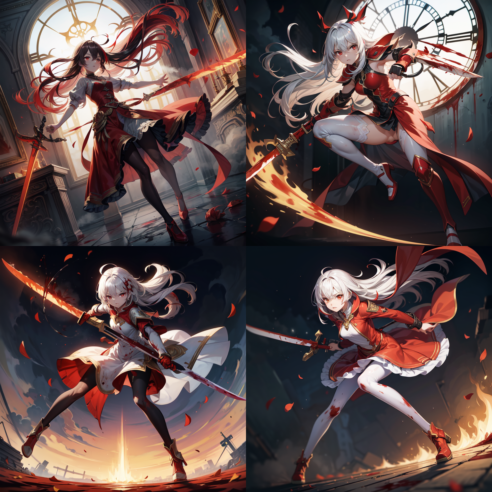

### `Stable Diffusion WebUI` 附录 2
* [Stable Diffusion WebUI](/stable%20diffusion%20web%20ui.md).md [[github.com]](https://github.com/AUTOMATIC1111/stable-diffusion-webui/tree/dev)
* `Models`
  * `Rabbit` [[civitai.com]](https://civitai.com/models/121696)
  * `Flat-2D Animerge` [[civitai.com]](https://civitai.com/models/35960)
  * `MeinaHentai` [[civitai.com]](https://civitai.com/models/12606)
* `通用起手式`
  ```
  ((masterpiece)), (((best quality))), ((ultra detailed)), ((illustration)), ((disheveled hair)), <lora:add_detail:1>, nsfw, pantyhose,
  # 反例
  negative_hand-neg, verybadimagenegative_v1.3, EasyNegativeV2, (worst quality, low quality:1.4), monochrome, (zombie), (interlocked fingers:1.2), extra monochrome, (sketch, comic), signature, logo, long body, lowres, bad anatomy, bad hands, text, error, missing fingers, extra digits, fewer digits, cropped, worst quality, low quality, normal quality, jpeg artifacts, signature, watermark, username, blurry, bad feet,
  ```
* `元素魔法目录 - 续`
  * `金石法`
    ```
    hide hands, (magic circle), principal, ((gem)), elegant, (holy), extremely detailed 8k wallpaper, (painting), (((ink))), (depth of field), (highres), cinematic lighting, (watercolor), detailed shadow, (((1girl))), (detailed flood feet), (((((long top sleeves past fingers))))), ((motion)), beautiful detailed full body, (leg up), (((sapphire frills))), (((yokozuwari in a golden cage))), gold cage, (birdcage), {{{very long dress cover the feet}}}, {translucent lace flowy dress}, {{detailed skin}}, (((long bright wavy hair))), juliet sleeves, (((hands hidden in puffy sleeves))), ((bare shoulders)), flat chest, ((crystal shoes)), ((((arms behind back)))), (((extremely detailed and cute anime face))), jewelry decoration, ((expressionless)), (iridescent gem headwear), (beautiful and detailed gem eyes), ((melt silver and gold)), looking at viewer, {detail of bare feet}, obsidian bracelet, gold arm ring, (precious refraction), {splash}, {{optical phenomena}}, detailed glow, (lightroom), (shine), chain, reflective, gem ornaments, nebula cosmic background, ((silver thorns)), (the huge golden clock core above), gear, falling petals, window pane, beautiful water, colored crystal, mirror, silver frame, canopy, detailed diamond, (columnar crystal), latin cross bud, (sputtering broken glass from the inside out), (flow), dark,
    # 反向
    artbook, game cg, duplicate, gross proportions, deformed, out of frame, 60s, 70s, 80s, 90s, 00s, ugly, morbid, mutation, death, kaiju, no humans, monster girl, arthropod girl, arthropod limbs, tentacles, blood, size difference, sketch, blurry face, blurry background, blurry foreground, disfigured, extra, extra arms, extra ears, extra breasts, extra legs, extra penis, extra mouth, multiple arms, multiple legs, mutilated, tranny, trans, transsexual, poorly drawn hands, extra fingers, mutated hand, poorly drawn face, bad proportions, extra limbs, more than 2 nipples, malformed limbs, missing arm, fused fingers, too many fingers, long neck, bad finger and legs, malformed mutated, missing limb, malformed hands,
    ```
    * `采样方法` `DDIM`
    * `迭代步数` `30`
    * `提示词引导系数` `7`
    * `生成`
      * `MeinaHentai`

  * `星语术`
    ```
    extremely detailed, style girl, long shot, small breasts, light grey very long hair, science fiction hair ornaments, beautiful and detailed deep eyes, beautiful detailed sky, beautiful detailed water, cinematic lighting, dramatic angle, (very long sleeves), frills, formal, close to viewer, (extremely delicate and beautiful), highres, official art, extremely detailed cg unity 8k wallpaper, ((starry sky)), star river, array star, holy, noble, ((oil painting)), ((wallpaper 8k cg)), (realistic), concept art, very blue and red and orange and pink hard light, intricate light, dynamic hair, haircut, dynamic fuzziness, beautiful and aesthetic, manga and anime,
    # 反向
    missing arms, long neck, humpbacked,
    ```
    * `采样方法` `Euler a`
    * `迭代步数` `50`
    * `提示词引导系数` `5`~`16`
    * `生成`
      * `MeinaHentai`
        * `提示词引导系数` `16`

        * `提示词引导系数` `5`

  * `西幻术`
    ```
    (extremely detailed cg unity 8k wallpaper), (best illumination, best shadow, extremely delicate and beautiful), classic, (impasto, photorealistic, painting, realistic, sketch, portrait), cinematic lighting, dynamic angle, floating, fine details, (bloom), (shine), glinting stars, (1girl:1.75), (loli), ((an extremely delicate and beautiful girl)), ((extremely detailed and cute anime face)), (((extremely detailed body))), (bare shoulders), small breasts, ((sideboob)), iridescence and rainbow sailor dress, (detailed wet clothes), (silk shawl:1,5), bikini, (iridescence and rainbow eyes), big top sleeves, frills, floating hair, mist encircles the mountains, dawn, (the castle stands out against the sky), flowery meadow, feather, nature, (sunlight), river, forest,
    # 反向
    inverted mountain, low quality illustration, low quality background, missing limbs, three arms, text font ui, malformed hands, long neck, limb, sleeveles, disfigured, malformed, mutated, (mutated hands and fingers:1.5), (mutation, poorly drawn:1.2), multiple breasts, futa, yaoi, three legs,
    ```
    * `采样方法` `Euler a`
    * `迭代步数` `30`
    * `提示词引导系数` `7`
    * `生成`
      * `MeinaHentai`

  * `血改法`
    ```
    ((solo)), amazing, 1girl, extremely detailed cg unity 8k wallpaper, (loli), (white hair), (((red streaked hair))), red eyes, (((full body))), (red hair), (((((holding a red sword))))), (angry face), (beautiful detailed eyes), ((blood drops)), ((blood fog)), light shaft, soft focus, character focus, long bangs, hair between eyes, looking at viewer, low hanging hair, ((splatter blood)), long hair, ((blood stains)), fighting stance, {{{{watercolor (medium)}}}}, ((white clock)), ((covered in blood)), flowing hair, exquisite flame, {{{{{{extremely beautiful and detailed anime face}}}}}}, dynamic angle, floating, (shine), extremely delicate and beautiful girl, bright skin, (best illustration), (best shadow), fine details, depth of field (bloom), (painting), {very delicate light, perfect and delicate limbs}, beautiful and detailed dress, flying red petals, holy lighting,
    # 反向
    (mutated hands and fingers:1.5), (mutation, poorly drawn:1.2), liquid body, text font ui, long neck, uncoordinated body, fused ears, huge breasts, ((((ugly)))),
    ```
    * `采样方法` `Euler a`
    * `迭代步数` `60`
    * `提示词引导系数` `7`
    * `生成`
      * `MeinaHentai`

  * `幻碎梦`
    ```
    8k Wallpaper, grand, ((extremely delicate and beautiful)), dynamic angle, rainbow hair, detailed and cute anime face, ((loli)), an extremely delicate and beautiful girl, flower, cry, water, corrugated, flower tire, broken glass, (broken screen), atlantis, transparent glass,
    # 反向
    deformed body, spectacles, deformed face, blue face,
    ```
    * `采样方法` `Euler`
    * `迭代步数` `50`
    * `提示词引导系数` `12`
    * `生成`
      * `MeinaHentai`


  * `碎梦`
    ```
    black hair, red eyes, 1girl, solo, ((delicate face)), ((extremely delicate and beautiful)), strange, space opera, space port, mechanical arms, elbow gloves, night, glisten, staring, cyberpunk, ((((city lights)))), (beautiful detailed eyes), science fiction, bodysuit, mechanical armor headdress, (bare shoulders),
    # 反向
    missing arms, long neck, humpbacked,
    ```
    * `采样方法` `LMS Karras`
    * `迭代步数` `48`
    * `提示词引导系数` `15`
    * `生成`
      * `MeinaHentai`
        * `<lora:add_detail:1>`

        * `<lora:add_detail:2>`

  * `末日`
    ```
    full body, blood mist, background urban rooftops, 1girl, despair, blood sakura, blood cherry blossom, torn clothes, cry with eyes open, solo, rain of blood, bandage, gunpowder smoke, beautiful deatailed shadow, splatter blood, dust, tyndall effect,
    # 反向
    missing arms, long neck, humpbacked,
    ```
    * `采样方法` `DPM++ SDE Karras`
    * `迭代步数` `50`
    * `提示词引导系数` `14`
    * `生成`
      * `MeinaHentai`


  * `人鱼法`
    ```
    {long hair}, {revealing dress}, {elbow gloves}, {{{{beautiful mermaid}}}}, {smirk}, {nose blush}, stretch, bare arms, bare navel, (incredibly absurdres), beautiful detailed eyes, blue hair, (highly detailed and beautiful fish tail:1.6), (((human hands))), (blue eyes), ((medium breasts)), (the lower body is a fish:1.9) and (no human thighs:1.2), seaweed, (full body), (white seashell), (curved and slender fish tail), (lower body bare:1.1), {beautiful tail fin}, ((underwater)), detailed water, ((an extremely delicate and beautiful girl)), (underwater forest), ((sunlight)), ((fish)), (floating), watercolor (medium), ((extremely delicate and beautiful)), ((coral)), floating hair, glowing eyes, (splash), (detailed glow), ((tyndall effect)), (landscape), hair ornament, (small whirlpool), ((sensation of water flowing)), (detailed scales on a mermaid),
    # 反向
    artist name, (human thighs:1.5), hips, foot, hands become fish tails, thigh gap, thigh, the lower body is human, (two legs:1.5), multiple breasts, (mutated hands and fingers:1.5), (long body:1.3), (mutation, poorly drawn:1.2), bad shadow, ugly, (extra legs:1.5), (too long tail:1.5), a hand with more than 5 fingers, one hand has less than 5 fingers, one hand has more than 5 digits, one hand with less than 5 digit,
    ```
    * `采样方法` `Euler a`
    * `迭代步数` `80`
    * `提示词引导系数` `6`
    * `生成`
      * `MeinaHentai`

  * `机凯姬 改`
    ```
    beautiful detailed eyes, colorful background, mechanical prosthesis, mecha coverage, emerging dark purple cross with white hair, pigtails, fluorescent purple, cool movement, rose red eyes, beautiful and detailed cyberpunk city, multicolored hair, beautiful detailed glow, 1girl, expressionless, cold expression, insanity, long bangs, long hair, lace, dynamic composition, motion, incredibly detailed, a lot of details, amazing fine details and brushstrokes, smooth, hd semi realistic anime cg concept art digital painting,
    # 反向
    bad legs, artist name, bad body, bad proportions, optical illusion,
    ```
    * `采样方法` `Euler a`
    * `迭代步数` `25`
    * `提示词引导系数` `4`
    * `生成`
      * `MeinaHentai`

  * `黄金律`
    ```
    amazing, {beautiful detailed eyes}, {1girl}, extremely detailed cg unity 8k wallpaper, highly detailed, official art, highres, original, blonde hair, yellow eyes, white skin, slim legs, mature female, sunrise, golden sky, magnificent architecture, beautiful detailed sky, overexposure, detailed background, delicate golden metal decorations,
    # 反向
    badfinger, bad legs, bad eye, bad face, eye asymmetry, simple background, mutation, poorly drawn, huge breasts, huge haunch, huge thighs, more than 2 nipples, huge calf, liquid body, disfigured, malformed, mutated, anatomical nonsense, text font ui, malformed hand, long neck, blurred, lowers, lowres, bad proportions, bad shadow, uncoordinated body, unnatural body, ui, 3d, bad hair, poorly drawn hair, fused hair, big muscles, ugly, fused face, poorly drawn face, cloned face, big face, long face, fused eyes, poorly drawn eyes, extra eyes, malformed limbs,
    ```
    * `采样方法` `Euler a`
    * `迭代步数` `51`
    * `提示词引导系数` `6`
    * `生成`
      * `MeinaHentai`

  * `星天使`
    ```
    {detailed light}, {extremely delicate and beautiful}, {beautiful detailed eyes}, {sunlight}, {{extremely light}}, {{extremely clothes}}, {{{holy light}}}, dynamic angle, 1girl, {{angel}}, solo, {{{loli}}}, light particles, very long hair, white hair, yellow eyes, {{glowing eyes}}, {{{expressionless}}}, [[light smile]], [[[[white tulle skirt]]]], {white silk}, looking at viewer, {{{{angel wings}}}}, {{large wings}}, multiple wings, {angel halo}, [[[starry sky]]], {{dusk sky}}, {{floating light spot}}, {{lots of feathers}},
    # 反向
    missing arms, big breasts, head wing, dutch angle, furrowed brow, raised eyebrows, looking away, thin, petite, skirt lift, {{smile}},
    ```
    * `采样方法` `Euler`
    * `迭代步数` `42`
    * `提示词引导系数` `7`
    * `生成`
      * `MeinaMix`

  * `森罗法`
    ```
    super fine illustration, {beautiful detailed eyes}, 1girl, fine details, depth of field, 4k wallpaper, blue sky, cumulus, wind, insane detailed frills, extremely detailed lace, very long hair, open mouth slightly, high ponytail, silver hair, small breasts, cumulonimbus capillatus, slender waist, many scattered luminous petals, hidden among light yellow flowers, bowed her head in frustration, many flying water droplets, upper body exposed, many scattered leaves, branch, angle, contour deepens, cinematic angle, {{{classic decorative border}}},
    ```
    * `采样方法` `DDIM`
    * `迭代步数` `50`
    * `提示词引导系数` `8`
    * `生成`
      * `MeinaHentai`

  * `星鬓法`
    ```
    stars in the eyes, starry sky adorns hair, 1girl, sparkling anime eyes, beautiful and detailed eyes, beautiful and detailed stars, blighting stars, emerging dark purple cross with white hair, multicolored hair, beautiful detailed sky, beautiful and detailed water, cinematic lighting, dramatic angle,
    # 反向
    bad legs, artist name, bad body, bad proportions, optical illusion,
    ```
    * `采样方法` `Euler a`
    * `迭代步数` `30`
    * `提示词引导系数` `6`
    * `生成`
      * `MeinaHentai`

  * `辉煌阳光法`
    ```
    {1girl}, amazing, beautiful detailed eyes, solo, fine details, depth of field, extremely detailed cg, original, extremely detailed wallpaper, {{highly detailed skin}}, {{messy hair}}, {small breasts}, {longuette}, {grassland}, {yellow eyes}, full body, incredibly absurdres, {gold hair}, lace, floating hair, a large number of environments, medieval, grace, a girl leans her hand on the fence, birds, altocumulus, 8k wallpaper, hair hoop, long hair, gem necklace, hair ornament, prospect, water eyes, wind, breeze, god ray, lawn, mountains and lake in the distance, the skirt swaying in the wind, sunlight through the trees, vast grassland, fence, blue sky, bloom, smile, glow, grass swaying in the wind,
    # 反向
    {{{{{{{{{bad hands}}}}}}}}}, small hands, multiple limbs, bad feet, long nails, {{{{interlocked fingers}}}}, milk, ugly, duplicate, morbid, mutilated, tranny, trans, transsexual, mutation, deformed, long neck, bad proportions, extra arms, extra legs, disfigured, more than 2 nipples, malformed, mutated, hermaphrodite, out of frame, extra drawn, long body, multiple breasts, cloned face, gross proportions, mutated hands, bad feet, long neck, missing limb, malformed limbs, malformed hands fused fingers, too many fingers, extra fingers, missing fingers, text font ui, futa, yaoi,
    ```
    * `采样方法` `Euler`
    * `迭代步数` `40`
    * `提示词引导系数` `7`
    * `生成`
      * `MeinaHentai`

  * `百溺法`
    ```
    (watercolor), (extremely detailed cg unity 8k wallpaper:1.21), (game cg), (1girl), (solo), (best illustration), (extremely detailed illustration), (beautiful detailed lighting:1.21), (from above), (extremely delicate and beautiful:1.21), cinematic lighting, dynamic angle, detailed wet clothes, blank stare, overexposure, floating, (beautiful detailed eyes), side blunt bangs, small breasts, black long straight, red eyes, aqua eyes, gradient eyes, black hair, very long hair, blunt bangs, (blood:1.21), white dress, frills, bowtie, (expressionless:1.21), extremely beautiful and detail water, (lying on the lake:1.21), (hairs curled in water:1.21), (blood red water:1.5), (red background:1.3), swirl,
    # 反向
    long face, extra legs, extra arms, fused arms, fused legs, extra feet, fused feet, abnormal legs, abnormal shoulders, poorly drawn shoulders, misplaced arms, misplaced legs, misplaced hands, abnormal hands, multiple heads, abnormal face, twisted head,
    ```
    * `采样方法` `Euler a`
    * `迭代步数` `20`
    * `提示词引导系数` `4.5`~`5.5`
    * `生成`
      * `MeinaHentai`
        * `提示词引导系数`
          * `5.5`

          * `4.5`

  * `沉入星海`
    ```
    {detailed light}, {extremely delicate and beautiful}, 1girl, {beautiful detailed eyes}, stars in the eyes, messy floating hair, colored inner hair, starry sky adorns hair, depth of field,
    # 反向
    missing arms,
    ```
    * `采样方法` `DDIM`
    * `迭代步数` `25`
    * `提示词引导系数` `5`
    * `生成`
      * `MeinaHentai`

  * `星之彩`
    ```
    (detailed light), (extremely delicate and beautiful), 1girl, cute face, upper body, two legs, long dress, (beautiful detailed eyes), stars in the eyes, messy floating hair, colored inner hair, starry sky adorns hair, (lots of big colorful bubbles), (pearl:0.9), (galaxy:0.9), depth of field,
    # 反向
    bad face, missing arms, missing legs, more than two legs, (small bubbles:0.72),
    ```
    * `采样方法` `DDIM`
    * `迭代步数` `25`
    * `提示词引导系数` `5`
    * `生成`
      * `MeinaHentai`

  * `花火法基础`
    ```
    (extremely detailed cg unity 8k wallpaper：1.21), (best illustration), (best shadow), (extremely delicate and beautiful), (1girl:1.46), floating, fine details, (bloom), (shine), glinting stars, (best detailed fireworks:1.46), (depth of field:1.33), (hanabi:1.33), beautiful detailed girl, (backlight:1.33), extremely delicate and beautiful girl, (summer long skirt:1.21), (solo:1.33), best details hair, (beautiful detailed water:1.21), night sky, (small breasts:1.33), beautiful detailed sky, beautiful detailed eyes, (arms behind back:1.33), long hair, (dynamic angle:1.33), long skirt,
    # 反向
    inverted mountain, low quality, flowers, grass, distorted mountain, distorted light, low quality light, low quality mountain, low quality illustration, low quality background, polar, bad body, bad proportions, gross proportions,
    ```
    * `采样方法` `Euler a`
    * `迭代步数` `50`
    * `提示词引导系数` `4.5`
    * `生成`
      * `MeinaHentai`

      * `Hassaku`

  * `暗鸦法`
    ```
    extremely detailed cg unity 8k, contour deepens for a beautifully detailed glow, (beautiful detailed eyes), (1girl:1.1), (bana:1.21), large top sleeves, floating black ash, beautiful and detailed black, red moon, (black cloud:1.21), (black Wings), black cloudy sky, burning, black dress, black expressionless face, beautiful and detailed white gloves, (crow), bat, (floating black clouds:1.5), white and black hair, long bangs, hair between eyes, black kneehighs, black ribbon, white bowtie, midriff, (half-closed eyes:1.15), (black fog:1.21), red eyes, (black smoke), complex patterns, (Black feathers float in the air:1.21), (arms behind back:1.33),
    # 反向
    (ugly:1.33), (duplicate:1.33), (morbid:1.21), (mutilated:1.21), (tranny:1.33), mutated hands, (poorly drawn hands:1.33), (bad proportions:1.33), extra limbs, cloned face, (disfigured:1.33), (more than 2 nipples:1.33), (missing arms:1.46), (extra legs:1.33), (fused fingers:1.61), (too many fingers:1.61), (unclear eyes:1.33), text font ui, malformed hands, missing limb, (mutated hands and finger:1.5), (mutation poorly drawn:1. 2), malformed mutated, multiple breasts, futa, yaoi, gross proportions, (malformed limbs), (missing legs:1.21), (extra arms:1.33), (fused fingers), (long neck:1.33),
    ```
    * `采样方法` `Euler a`
    * `迭代步数` `50`
    * `提示词引导系数` `4.5`
    * `生成`
      * `MeinaHentai`

  * `万物熔炉`
    ```
    amazing, beautiful detailed eyes,(1girl:1.46), fine detail, depth of field, extremely detailed cg unity 8k wallpaper, (full body:1.61), (cute anime face:1.33), (a girl wearing a black and white taoist robe:1.33), (extremely gorgeous magic style:1.21), (gold and silver lace:1.46), (flowing lace:1.33), (flowing (black:1.21) and white background:1.33), (gorgeous and detailed eyes:1.61), (gorgeous detailed face:1.94), (floating hair:1.21), (pick and dye black hair white:1.33), (flowing transparent black:1.33), (flowing transparent white:1.33), (ink:1.61), (small breasts:1.46), (extremely detailed gorgeous tiara:1.33), (black and white hair:1.33), (black hair stick:1.21), (white hair ornament:1.21), (gold gorgeous necklace:1.21), (flowing hair:1.21), (picture fills canvas:1.33), (the character is in the center of the frame:1.21), (flowing:1.33), (bright pupils:1.21), (melt:1.46), (black and white melt:1.61),
    # 反向
    (ugly:1.33), (duplicate:1.33), (morbid:1.21), (mutilated:1.21), (tranny:1.33), mutated hands, (poorly drawn hands:1.33), (bad proportions:1.33), extra limbs, cloned face, (disfigured:1.33), (more than 2 nipples:1.33) ,(missing arms:1.46), (extra legs:1.33), (fused fingers:1.61), (too many fingers:1.61), (unclear eyes:1.33), text font ui, malformed hands, long neck, missing limb, (mutated hands and finger:1.5), (mutation poorly drawn:1.2), malformed mutated, multiple breasts, futa, yaoi,
    ```
    * `采样方法` `Euler`
    * `迭代步数` `39`
    * `提示词引导系数` `7`
    * `生成`
      * `MeinaMix`

