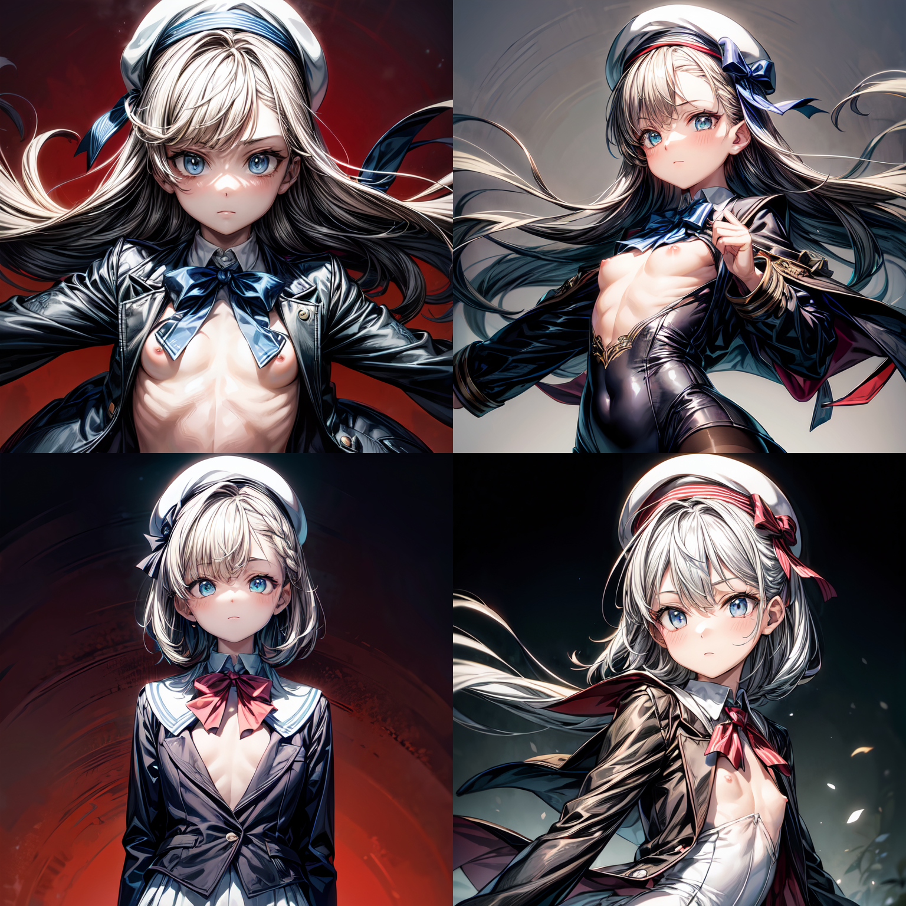
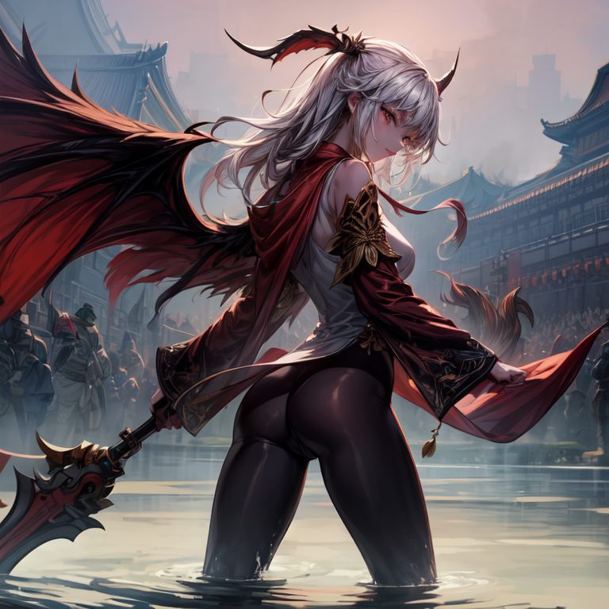
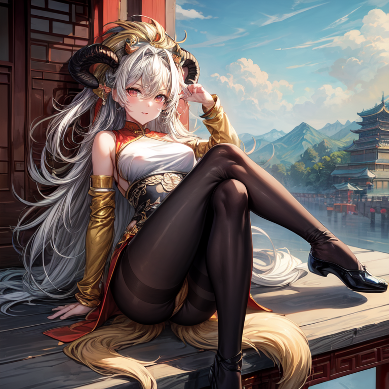
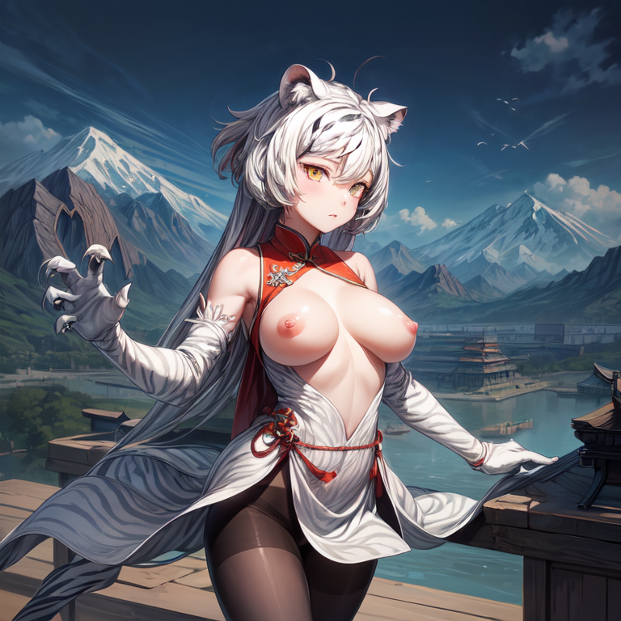

### `Stable Diffusion WebUI` 附录 3
* [Stable Diffusion WebUI](/stable%20diffusion%20web%20ui.md).md [[github.com]](https://github.com/AUTOMATIC1111/stable-diffusion-webui/tree/dev)
* `Models`
  * `Rabbit` [[civitai.com]](https://civitai.com/models/121696)
  * `Flat-2D Animerge` [[civitai.com]](https://civitai.com/models/35960)
  * `MeinaHentai` [[civitai.com]](https://civitai.com/models/12606)
* `通用起手式`
  ```
  ((masterpiece)), (((best quality))), ((ultra detailed)), ((illustration)), ((disheveled hair)), <lora:add_detail:1>, nsfw, pantyhose,
  # 反例
  negative_hand-neg, verybadimagenegative_v1.3, EasyNegativeV2, (worst quality, low quality:1.4), monochrome, (zombie), (interlocked fingers:1.2), extra monochrome, (sketch, comic), signature, logo, long body, lowres, bad anatomy, bad hands, text, error, missing fingers, extra digits, fewer digits, cropped, worst quality, low quality, normal quality, jpeg artifacts, signature, watermark, username, blurry, bad feet,
  ```
* `元素魔法目录 - 二点零`
  * `嘻哈风`
    ```
    {{high quality}}, {{{extreme details}}}, {{clear facial features}}, backlight, 1girl, {dim scene}, {{complex and messy fluorescent street graffiti on the wall}}, face the viewer, full body, hip hop Style, splashed paint dynamic angle, demonic smile, cool and fashionable hoodie, hands in pockets, visual impact, {spotlight}, {{american caricature painting style}}, contour deepens, comic, high contrast,
    # 反向
    missing arms, long neck, humpbacked, malformed limbs, poorly drawn, poorly drawn hands, mutilated, missing legs, {unclear eyes}, {more than 2 thighs}, deformed, extra legs, mutated hands and fingers, 3 legs, bad face, extra limbs, {{malformed}},
    ```
    * `采样方法` `DDIM`
    * `迭代步数` `50`~`80`
    * `提示词引导系数` `7`~`7.5`
    * `生成`
      * `MeinaHentai`

  * `立体主义`
    ```
    maidens of avignon, colorful, flat color, limited palette, {{picasso}}, {{cubism}}, {{1girl}}, pretty face, upper body, flat chest, floating black jacket, white school uniform, white beret, white beret bow,
    ```
    * `采样方法` `DPM++ SDE Karras`
    * `迭代步数` `26`
    * `提示词引导系数` `10`
    * `生成`
      * `MeinaHentai`

  * `故障艺术`
    ```
    {{cute anime face}}, (best illustration), {extremely delicate and beautiful}, {album cover}, album, album description, {error}, {{glitch lump} on the face}, (glitch art:1.5), {pixelation on face}, double exposure, {chromatic aberration}, light leaks, noise and grain, color degradation, glitch lettering, design, 1girl, art, abstract art, (flat chest, short red hair, short wavy hair, floating black jacket, white school uniform, white beret, bow over white beret, floating black feathers:0.5), geometry, clear lines, square, bright, limited palette,
    # 反向
    missing arms, long neck, humpbacked,
    ```
    * `采样方法` `DDIM`
    * `迭代步数` `28`
    * `提示词引导系数` `11`
    * `生成`
      * `MeinaHentai`

  * `穷奇录`
    ```
    original, extremely detailed wallpaper, (((beijing opera))), (sketch), (wash painting), ((splash of color)), ((splash ink)), ((((dyeing)))), ((chinese painting)), ((a mythical ferocious animal)), {{the bull}}, {{long horn}}, {{wings on the back}}, (red and black wings), (solo), mountain, big and strong, diabolical, tyrannical,
    # 反向
    more than 4 hooves, less than 4 hooves, too many hooves, too many horns, less than 2 wings, more than 2 wings, more than 2 cows,
    ```
    * `采样方法` `Euler`
    * `迭代步数` `40`
    * `提示词引导系数` `5.5`
    * `生成`
      * `MeinaHentai`

  * `狡兽录`
    ```
    original, extremely detailed wallpaper, (((beijing opera))), (sketch), (wash painting), ((splash of color)), ((splash ink)), ((((dyeing)))), ((chinese painting)), ((colorful)), (beautiful and delicate mountain), stone figure, (solo), (fantasy creatures), dog body, ((chinese jiao)), (((horns))), (golden dog body:1.3), (golden lion head), leopard print, canines, lion head, flying to cloudy areas, big and strong, diabolical, tyrannical, simple background,
    # 反向
    missing arms, large breasts,
    ```
    * `采样方法` `Euler`
    * `迭代步数` `40`
    * `提示词引导系数` `5.5`
    * `生成`
      * `MeinaHentai`

  * `白虎志`
    ```
    original, extremely detailed wallpaper, (((beijing opera))), (sketch), (wash painting), ((splash of color)), ((splash ink)), ((((dyeing)))), ((chinese painting)), ((colorful)) (beautiful and delicate mountain), (fantasy creatures), ((chinese white tiger)), (solo:1.8), black markings, (white tiger), beautiful and delicate yellow eyes, huge claws, big and strong, diabolical, tyrannical, (mountains),
    # 反向
    missing arms, large breasts,
    ```
    * `采样方法` `Euler`
    * `迭代步数` `40`
    * `提示词引导系数` `5.5`
    * `生成`
      * `MeinaHentai`
