### `Stable Diffusion WebUI` 附录 3
* [Stable Diffusion WebUI](/stable%20diffusion%20web%20ui.md).md [[github.com]](https://github.com/AUTOMATIC1111/stable-diffusion-webui/tree/dev)
* `Models`
  * `Rabbit` [[civitai.com]](https://civitai.com/models/121696)
  * `Flat-2D Animerge` [[civitai.com]](https://civitai.com/models/35960)
  * `MeinaHentai` [[civitai.com]](https://civitai.com/models/12606)
* `通用起手式`
  ```
  ((masterpiece)), (((best quality))), ((ultra detailed)), ((illustration)), ((disheveled hair)), <lora:add_detail:1>, nsfw, pantyhose,
  # 反例
  negative_hand-neg, verybadimagenegative_v1.3, EasyNegativeV2, (worst quality, low quality:1.4), monochrome, (zombie), (interlocked fingers:1.2), extra monochrome, (sketch, comic), signature, logo, long body, lowres, bad anatomy, bad hands, text, error, missing fingers, extra digits, fewer digits, cropped, worst quality, low quality, normal quality, jpeg artifacts, signature, watermark, username, blurry, bad feet,
  ```
* `元素魔法目录 - 二点零`
  * `人像水墨法`
    ```
    (((((full body))))), (((((most detailed girl))))), (((1girl))), ((((black hair)))), (solo), ((extremely detailed)), ((detailed face)), ((((ink painting)))), ((chinese ink painting)), ((((ink dyeing)))), (((watercolor))), ((chinese brush painting)), (((extremely delicate and beautiful girl))), (((beautiful detailed eyes))), (cheongsam), (chinese style), ((red ink)), smile, ink background, long hair, beautiful detailed hair, petals, (((soaked))), ((((floating hair)))), (((the character is in the center of the screen))), (((flowing))),
    # 反向
    inverted mountain, flowers, grass, distorted mountain, distorted light, low quality light, low quality mountain, low quality illustration, low quality background, (((ugly))), (((duplicate))), ((morbid)), ((mutilated)), (((tranny))), mutated hands, (((poorly drawn hands))), (((bad proportions))), extra limbs, cloned face, (((disfigured))), (((more than 2 nipples))), ((((missing arms)))), (((extra legs))), (((((fused fingers))))), (((((too many fingers))))), (((unclear eyes))), text font ui, malformed hands, long neck, missing limb, (mutated hands and finger:1.5), (mutation poorly drawn:1.2), malformed mutated, multiple breasts, futa, yaoi,
    ```
    * `采样方法` `Euler a`
    * `迭代步数` `30`
    * `提示词引导系数` `7`
    * `生成`
      * `MeinaHentai`
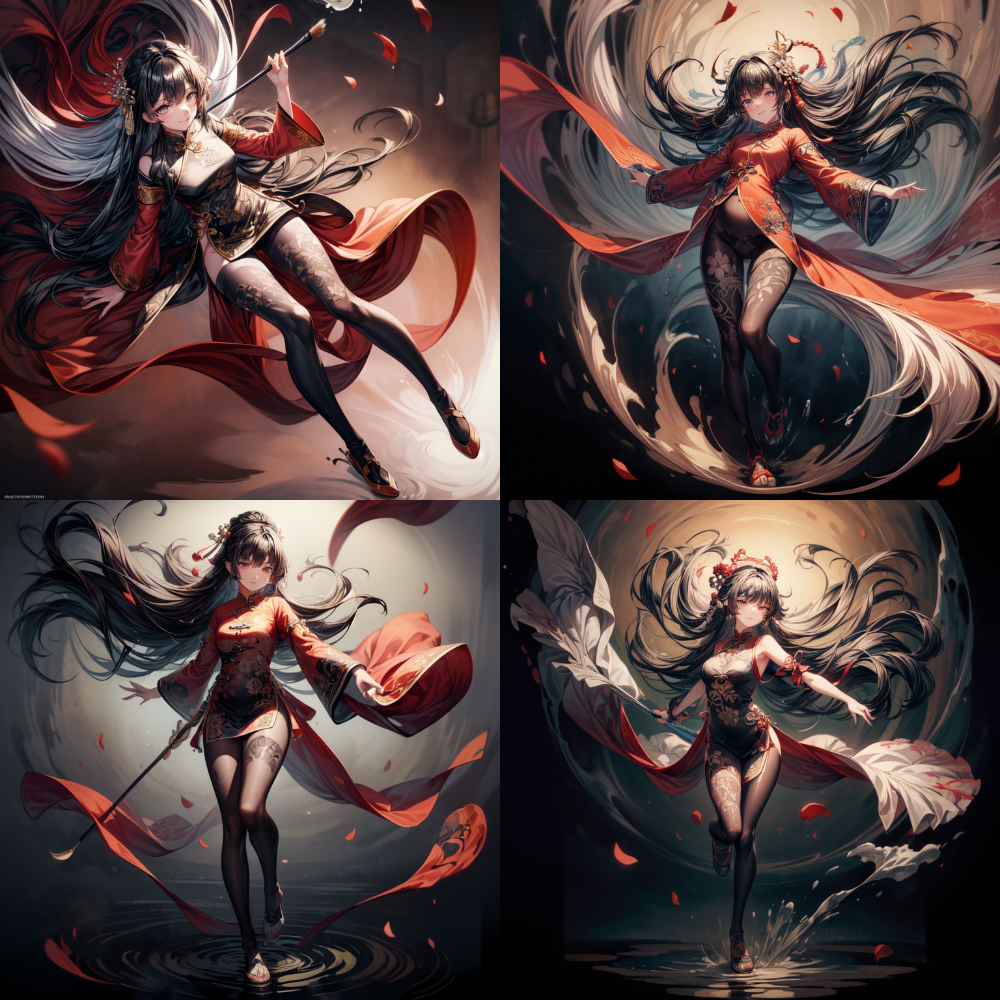
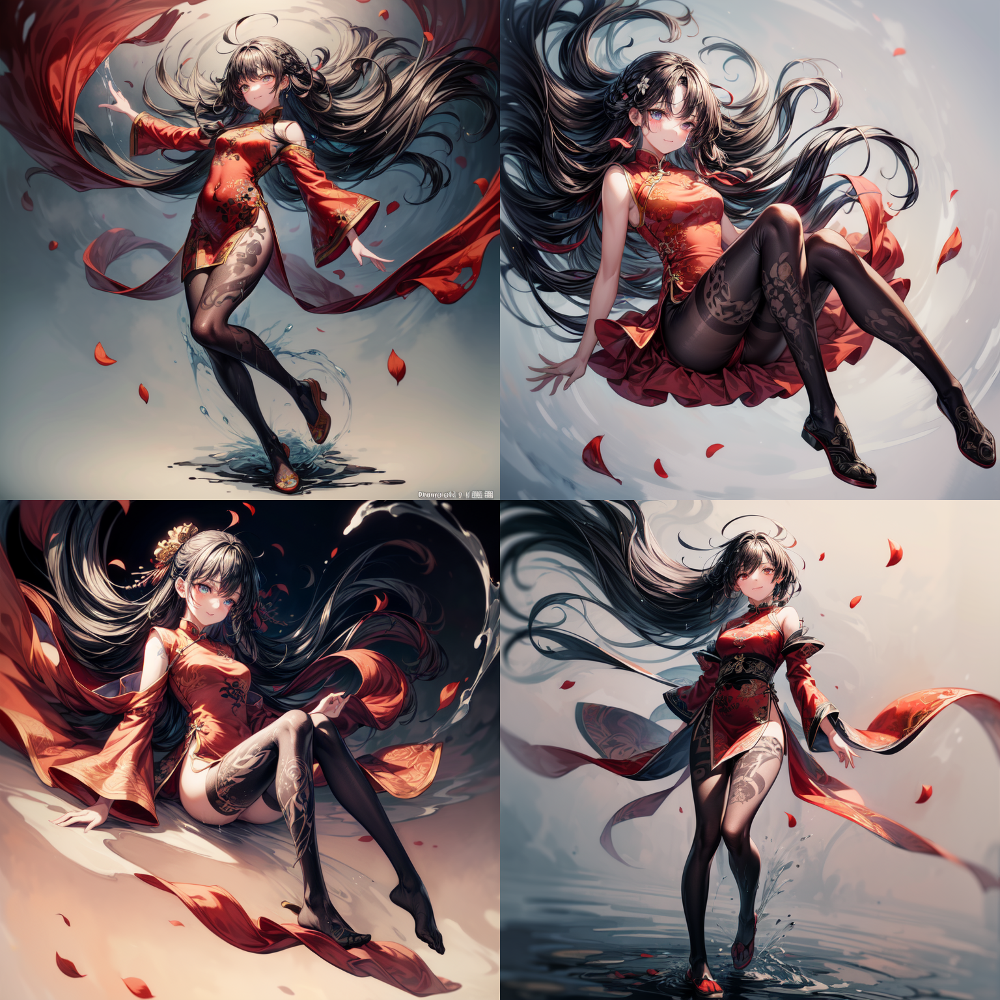
  * `太空兔`
    ```
    1girl, aqua theme, black hair, blink, blue jacket, book, bookshelf, closed mouth, colored tips, constellation, flat color, hold, holding wand, jacket, looking up, lying, male focus, multicolored hair, no lineart, orange hair, orbital path, planet, shirt, short hair, sitting, solo, space, space station, spacecraft interior, star wand, stuffed animal, stuffed bunny, stuffed toy, telescope, utaite (singer), wand, white footwear, white shirt,
    # 反向
    missing arms, long neck, humpbacked,
    ```
    * `采样方法` `DPM++ SDE Karras`
    * `迭代步数` `30`
    * `提示词引导系数` `5.5`
    * `生成`
      * `MeinaHentai`
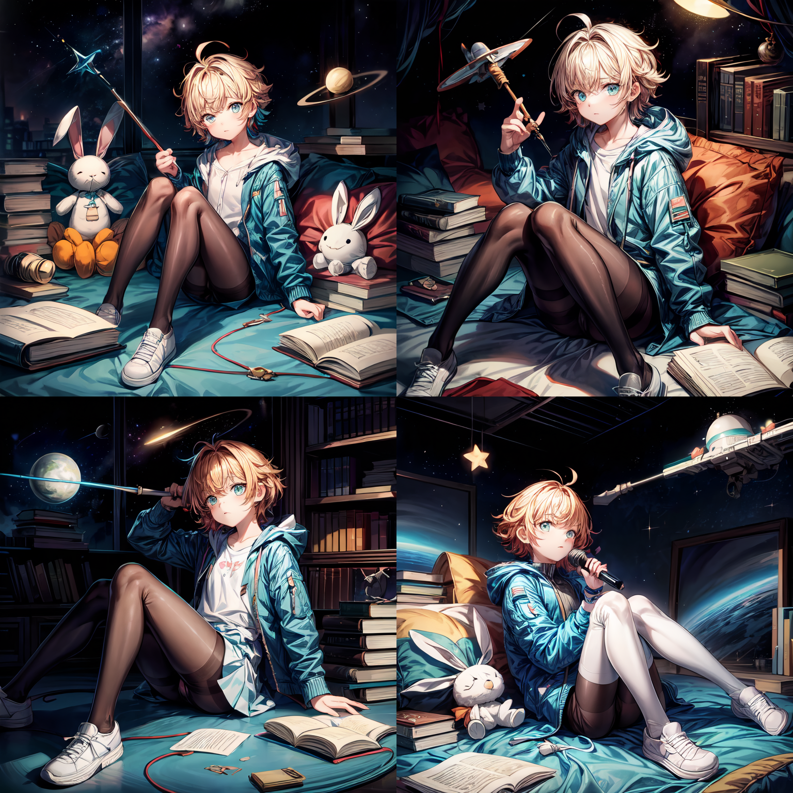
  * `跑团法`
    ```
    (highly detailed), (impasto), intricate, church painting, (((1girl))), painting frame, fantasy, delicate grassland, sorceress, shepherd long white hair, red dragon eyes, white dress, (pretty face), beautiful detailed face, extremely delicate and beautiful girl, alps, evergreen coniferous forest, clear sky, wind, beautiful sky, cumulus,
    # 反向
    realistic, 3d, (large breasts), blush, long neck, bad arms, multiple people, animals, missing legs, huge person,
    ```
    * `采样方法` `DDIM`
    * `迭代步数` `42`
    * `提示词引导系数` `7`
    * `生成`
      * `MeinaHentai`
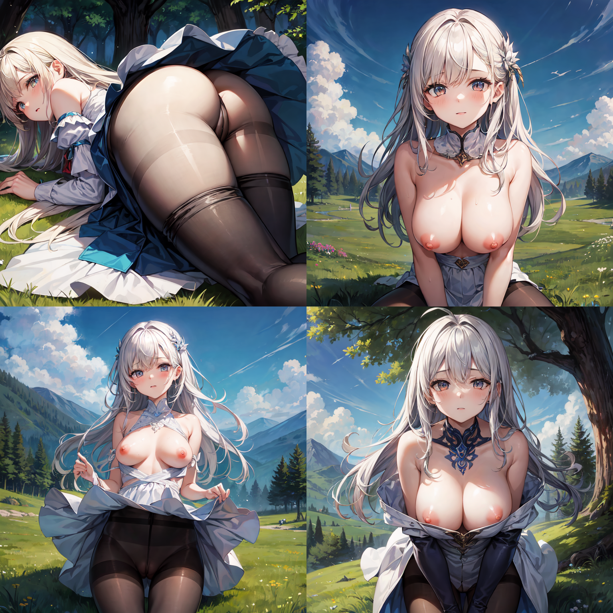
  * `古典肖像法`
    ```
    ((oil painting\(medium\))), ((impasto)), highres, (beautiful detailed), classicism, rembrandt lighting, brown background, detailed face, sit on the chair, (portrait), picture frame,
    # 反向
    artist name, blurred, poorly drawn face, extra fingers, fused fingers, abnormal fingers,  fused hands, ugly,
    ```
    * `采样方法` `Euler a`
    * `迭代步数` `20`
    * `提示词引导系数` `7`
    * `生成`
      * `MeinaHentai`
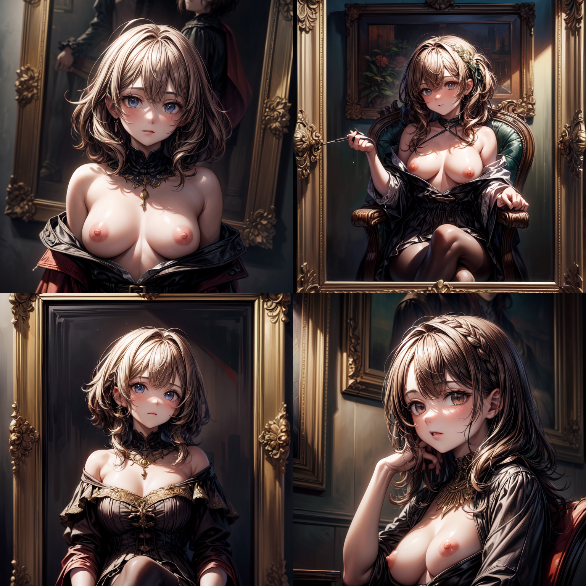
  * `半厚涂`
    ```
    (((extremely detailed))), (((colorful))), solo, 1girl, breeze, cinematic lighting, vest, ((fasle impasto paintings)), gradient eyes, beautiful detailed sky, watercolor, ambient light,
    ```
    * `采样方法` `DDIM`
    * `迭代步数` `40`
    * `提示词引导系数` `4`
    * `生成`
      * `MeinaHentai`
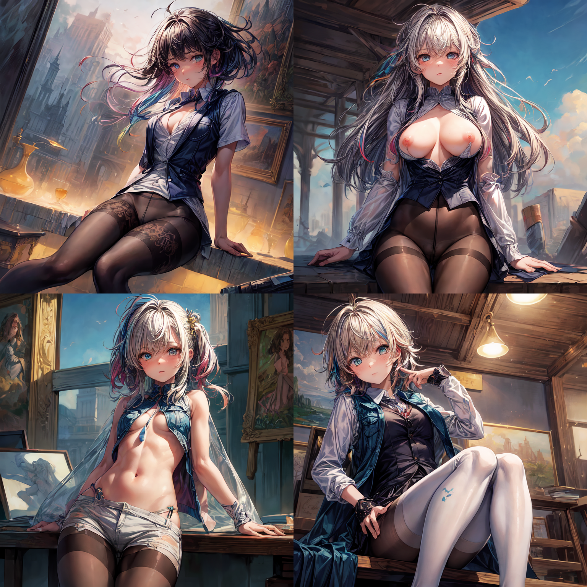
  * `繁浮法`
    ```
    {{{ukiyo-e style}}}, {{flat style}}, {simple colors}, {katsushika hokusai\(fate\}, long hair, hair flower, {{black hair}}, red eyes, red sky, {chinoiserie}, kimono, maple leaves flying, {{1girl}}, {{{solo}}}, {{ extremely delicate and beautiful}}, blank stare, close to viewer, {breeze}, {flying splash}, {flying petals}, wind, {gorgeous and rich graphics},
    # 反向
    multiple breasts, no characters, (mutated hands and fingers:1.5), (mutation, poorly drawn :1.2), greyscale, liquid body, liquid tongue, disfigured, malformed, mutated, anatomical nonsense, text font ui, malformed hands, long neck, blurred, lowers, bad proportions, bad shadow, uncoordinated body, unnatural body, fused breasts, bad breasts, huge breasts, poorly drawn breasts, extra breasts, liquid breasts, heavy breasts, missing breasts, huge haunch, huge thighs, huge calf, fused hand, missing hand, disappearing arms, disappearing thighs, disappearing calf, disappearing legs, fused ears, bad ears, poorly drawn ears, extra ears, liquid ears, heavy ears, missing ears, fused animal ears, bad animal ears, poorly drawn animal ears, extra animal ears, liquid animal ears, heavy animal ears, missing animal ears, ui, missing limb, fused fingers, a hand with more than 5 fingers, hands with fewer than 5 fingers, 1 hand has more than 5 digits, less than 5 digits on one hand, fused digits, missing digits, bad digits, liquid digits, colorful tongue, black tongue,
    ```
    * `采样方法` `DDIM`
    * `迭代步数` `50`
    * `提示词引导系数` `8`
    * `生成`
      * `MeinaHentai`
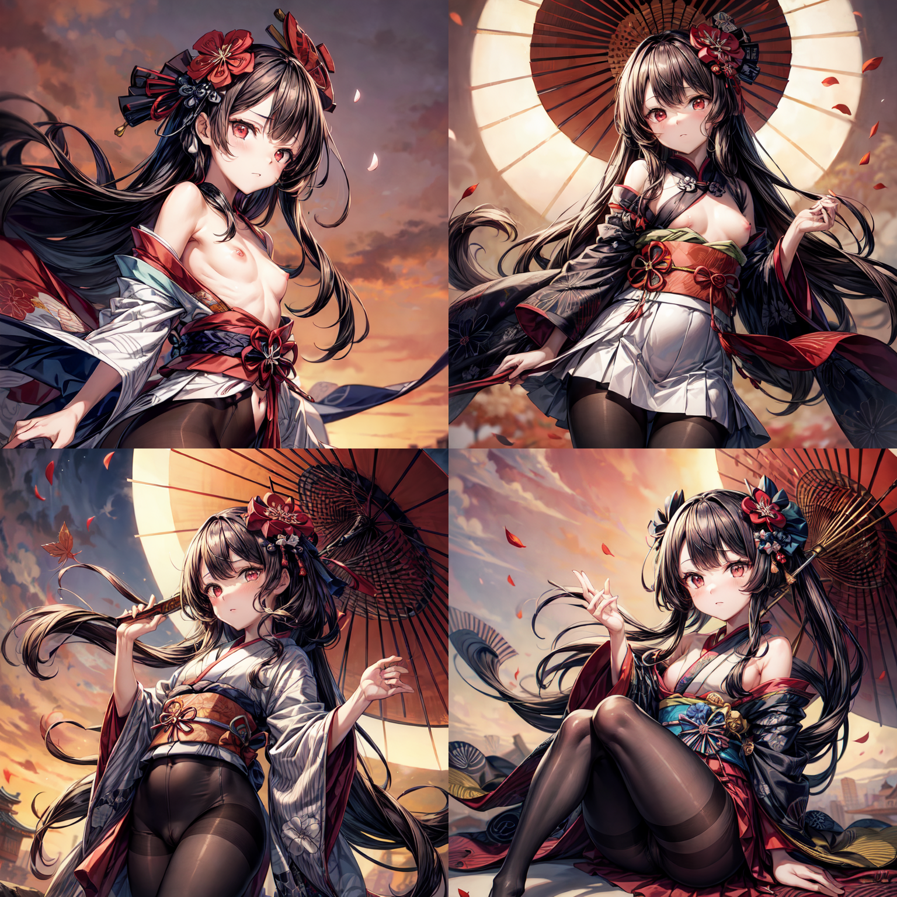
  * `彩墨法`
    ```
    colorful paintings, ((chinese colored ink)), (((chinese color ink painting style))), ((very precise and detailed)), (((a charming chinese girl, 1girl, solo, delicate beautiful face))), (floating), (amazing), (absurd), ((sharp focus)), ((extremely detailed)), ((high saturation)), (colorful ink splatters all around), ((extremely detailed body)), ((colorful)),
    # 反向
    text font ui, blurred, bad shadow, 3d, 3d game, 3d game scene, 3d character, duplicate, strong girl, obesity, greyscale, lowers, qr code, barcode, censored, mosaic, excrement, faeces, shit,
    ```
    * `采样方法` `Euler`
    * `迭代步数` `40`
    * `提示词引导系数` `8`
    * `生成`
      * `MeinaHentai`
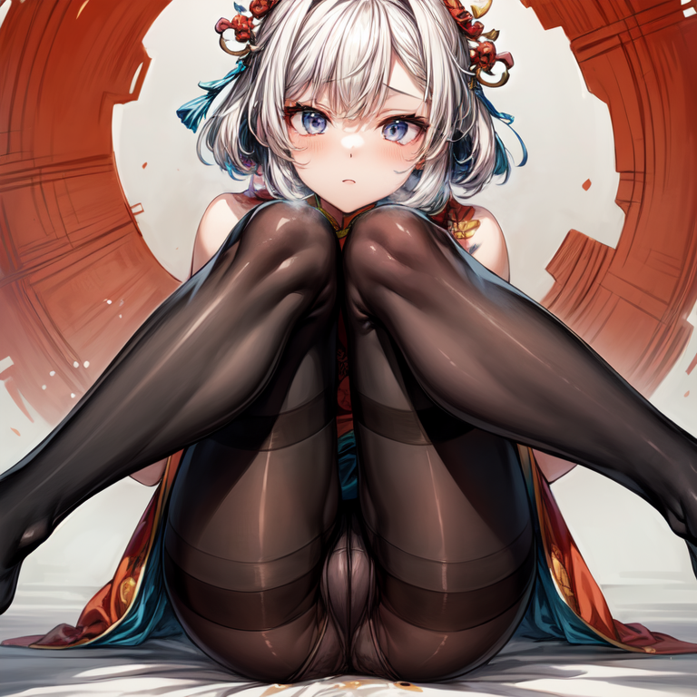
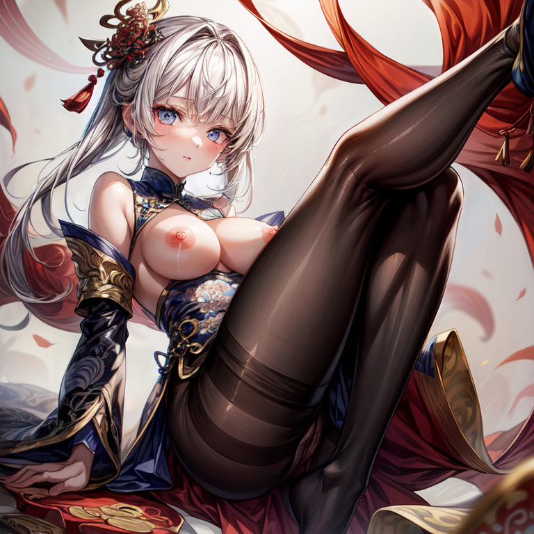
  * `漫画风格`
    ```
    (comic), (creative frame design), flat color, {{{limited palette}}}, story, {girl}, gothic, {speech bubble}, (monochrome:3), {speak arrow (symbol)}, meme, manga frame, ((dark intense shadow)), ((cinematic lighting)), ((overexposure)), cute anime faces, sketch, {{storyboard}}, (pretty face), section, frame, {border}, {split theme}, {{split-screen}}, {cartoon split},
    river, (forest), palace, (fairyland, feather, flowers, nature), (sunlight), hazy fog, mist, (beautiful detailed sky),
    {2girls}, flat chest, diamond and glaring eyes, black eyes, beautiful detailed cold face, {short red hair}, short wavy hair, beautiful detailed eyes, glowing eyes, touhou project, 1girl, braid, dress, eyelash, frilly skirt, holding knife, holster, maid, maid headdress, medium hair, pocket watch, puffy short sleeves, silver chain, thigh strap, wrist cuffs, open mouth, blank stare, smile, angry, tears,
    # 反向
    multiple breasts, (mutated hands and fingers:1.5), (mutation, poorly drawn:1.2), greyscale, liquid body, liquid tongue, disfigured, malformed, mutated, anatomical nonsense, text font ui, malformed hands, long neck, blurred, lowers, bad proportions, bad shadow, uncoordinated body, unnatural body, fused breasts, bad breasts, huge breasts, poorly drawn breasts, extra breasts, liquid breasts, heavy breasts, missing breasts, huge haunch, huge thighs, huge calf, fused hand, missing hand, unshaped, duplicate,
    ```
    * `采样方法` `Euler`
    * `迭代步数` `28`
    * `提示词引导系数` `10`
    * `生成`
      * `MeinaHentai`
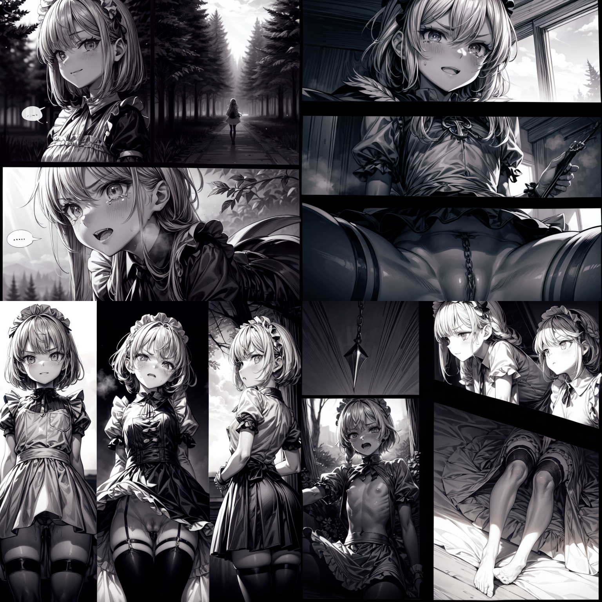
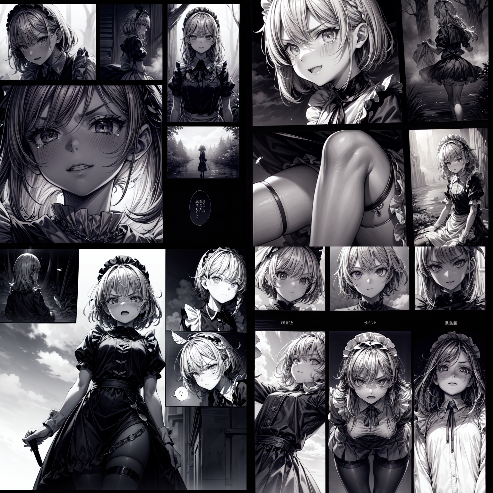
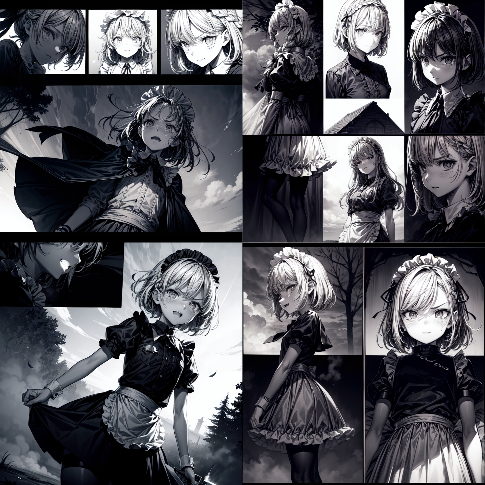
  * `默剧法`
    ```
    highres, original, very detailed wallpaper, extremely delicate and beautiful, movie lighting, volumetric lighting, bloom effect, light particles, ((1girl)), beautiful and delicate eyes, long sleeves, hoodie, frills, no shadow, simple background, (((black background))), european style, bright skin, (((1980s\(style\)))), movie theater, silhouette, greyscale, monochrome, ((big wavy hair)), slit pupil, (((look back))), movie angle, (((close-up))), (((portrait))), lens flare, seductive smile, tarot, medium hair,
    ```
    * `采样方法` `Euler`
    * `迭代步数` `40`
    * `提示词引导系数` `12`
    * `生成`
      * `MeinaHentai`
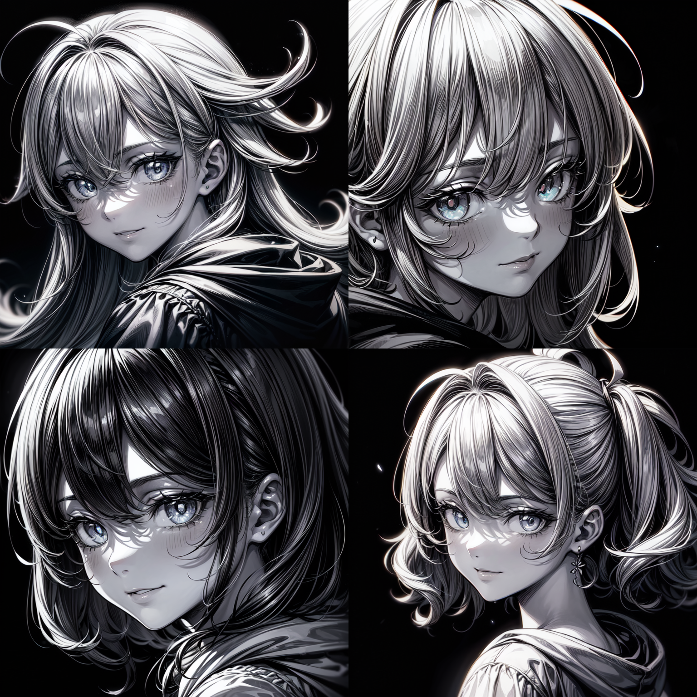
  * `嘻哈风`
    ```
    {{high quality}}, {{{extreme details}}}, {{clear facial features}}, backlight, 1girl, {dim scene}, {{complex and messy fluorescent street graffiti on the wall}}, face the viewer, full body, hip hop Style, splashed paint dynamic angle, demonic smile, cool and fashionable hoodie, hands in pockets, visual impact, {spotlight}, {{american caricature painting style}}, contour deepens, comic, high contrast,
    # 反向
    missing arms, long neck, humpbacked, malformed limbs, poorly drawn, poorly drawn hands, mutilated, missing legs, {unclear eyes}, {more than 2 thighs}, deformed, extra legs, mutated hands and fingers, 3 legs, bad face, extra limbs, {{malformed}},
    ```
    * `采样方法` `DDIM`
    * `迭代步数` `50`~`80`
    * `提示词引导系数` `7`~`7.5`
    * `生成`
      * `MeinaHentai`
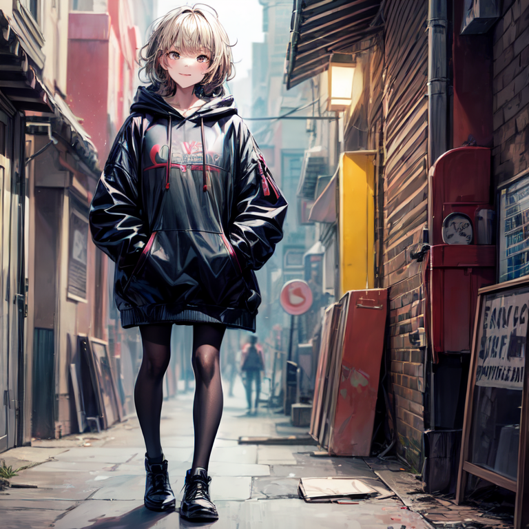
  * `立体主义`
    ```
    maidens of avignon, colorful, flat color, limited palette, {{picasso}}, {{cubism}}, {{1girl}}, pretty face, upper body, flat chest, floating black jacket, white school uniform, white beret, white beret bow,
    ```
    * `采样方法` `DPM++ SDE Karras`
    * `迭代步数` `26`
    * `提示词引导系数` `10`
    * `生成`
      * `MeinaHentai`

  * `故障艺术`
    ```
    {{cute anime face}}, (best illustration), {extremely delicate and beautiful}, {album cover}, album, album description, {error}, {{glitch lump} on the face}, (glitch art:1.5), {pixelation on face}, double exposure, {chromatic aberration}, light leaks, noise and grain, color degradation, glitch lettering, design, 1girl, art, abstract art, (flat chest, short red hair, short wavy hair, floating black jacket, white school uniform, white beret, bow over white beret, floating black feathers:0.5), geometry, clear lines, square, bright, limited palette,
    # 反向
    missing arms, long neck, humpbacked,
    ```
    * `采样方法` `DDIM`
    * `迭代步数` `28`
    * `提示词引导系数` `11`
    * `生成`
      * `MeinaHentai`

  * `穷奇录`
    ```
    original, extremely detailed wallpaper, (((beijing opera))), (sketch), (wash painting), ((splash of color)), ((splash ink)), ((((dyeing)))), ((chinese painting)), ((a mythical ferocious animal)), {{the bull}}, {{long horn}}, {{wings on the back}}, (red and black wings), (solo), mountain, big and strong, diabolical, tyrannical,
    # 反向
    more than 4 hooves, less than 4 hooves, too many hooves, too many horns, less than 2 wings, more than 2 wings, more than 2 cows,
    ```
    * `采样方法` `Euler`
    * `迭代步数` `40`
    * `提示词引导系数` `5.5`
    * `生成`
      * `MeinaHentai`

  * `狡兽录`
    ```
    original, extremely detailed wallpaper, (((beijing opera))), (sketch), (wash painting), ((splash of color)), ((splash ink)), ((((dyeing)))), ((chinese painting)), ((colorful)), (beautiful and delicate mountain), stone figure, (solo), (fantasy creatures), dog body, ((chinese jiao)), (((horns))), (golden dog body:1.3), (golden lion head), leopard print, canines, lion head, flying to cloudy areas, big and strong, diabolical, tyrannical, simple background,
    # 反向
    missing arms, large breasts,
    ```
    * `采样方法` `Euler`
    * `迭代步数` `40`
    * `提示词引导系数` `5.5`
    * `生成`
      * `MeinaHentai`

  * `白虎志`
    ```
    original, extremely detailed wallpaper, (((beijing opera))), (sketch), (wash painting), ((splash of color)), ((splash ink)), ((((dyeing)))), ((chinese painting)), ((colorful)) (beautiful and delicate mountain), (fantasy creatures), ((chinese white tiger)), (solo:1.8), black markings, (white tiger), beautiful and delicate yellow eyes, huge claws, big and strong, diabolical, tyrannical, (mountains),
    # 反向
    missing arms, large breasts,
    ```
    * `采样方法` `Euler`
    * `迭代步数` `40`
    * `提示词引导系数` `5.5`
    * `生成`
      * `MeinaHentai`
