### `Stable Diffusion WebUI`附录
* [Stable Diffusion WebUI](/stable%20diffusion%20web%20ui.md).md [[github.com]](https://github.com/AUTOMATIC1111/stable-diffusion-webui/tree/dev)
* `Models`
  * `Rabbit` [[civitai.com]](https://civitai.com/models/121696)
  * `Flat-2D Animerge` [[civitai.com]](https://civitai.com/models/35960)
  * `MeinaHentai` [[civitai.com]](https://civitai.com/models/12606)
* `通用起手式`
  ```
  nsfw, pantyhose, (masterpiece:1.21), (best quality:1.33), (ultra-detailed:1.21), (illustration:1.21), (disheveled hair:1.21), <lora:add_detail:2>,

  # 反例
  negative_hand-neg, verybadimagenegative_v1.3, EasyNegativeV2, (worst quality, low quality:1.4), monochrome, zombie, (interlocked fingers:1.2), extra monochrome, signature, text, logo, long body, lowres, bad anatomy, bad hands, missing finger, extra digits, fewer digits, cropped,
  ```
* `元素魔法目录`
  * `蔷薇法`
    ```
    (an extremely delicate and beautiful:1.21), beautiful detailed eyes, (detailed light), (beautiful deatailed shadow), 1girl, (loli), (small breasts), floating hair, glowing eyes, black hair, red eyes, sad, lolita, bare shoulders, white dress, (rose:1.21), (vines), (blood), cage, bandage, red rope, (sketch:1.21), (painting),
    # 反向
    text, error, normal quality, jpeg artifacts, watermark, username, blurry, bad feet,
    ```
    * `采样方法` `Euler a`
    * `迭代步数` `40`
    * `提示词引导系数` `5.5`
    * `生成`
      * `MeinaHentai`
        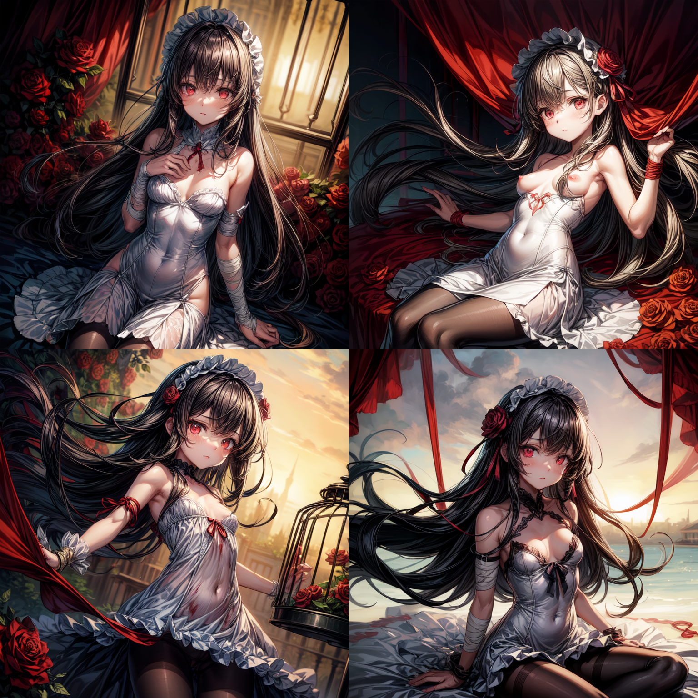
  * `泡泡法`
    ```
    (an extremely delicate and beautiful:1.21), dynamic angle, floating, (beautiful detailed eyes), (detailed light), (ink:1.33), depth of field, (watercolor:1.21), 1girl, small breasts, red hair, blue eyes, (veil:1.21), bare shoulders, navel, (starry sky), (desert), (floating sand flow), (colorful bubble:1.33),
    # 反向
    text, error, normal quality, jpeg artifacts, watermark, username, blurry, bad feet,
    ```
    * `采样方法` `Euler a`
    * `迭代步数` `40`
    * `提示词引导系数` `5.5`
    * `生成`
      * `MeinaHentai`
        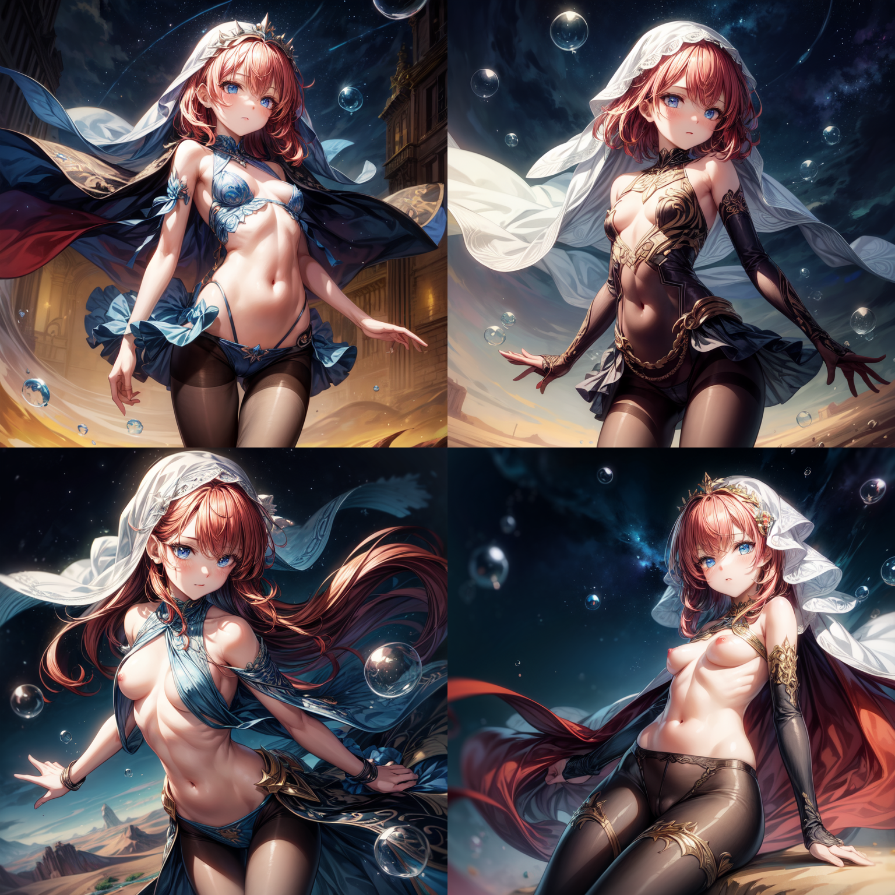
  * `森林法`
    ```
    (an extremely delicate and beautiful:1.21), dynamic angle, floating, (beautiful detailed eyes), (detailed light), (1girl), loli, small breasts, floating hair, glowing eyes, pointy ears, white hair, green eyes, halter dress, feather, leaves, nature, (sunlight), river, (forest), (painting), (sketch), (bloom),
    # 反向
    text, error, normal quality, jpeg artifacts, watermark, username, blurry, bad feet,
    ```
    * `采样方法` `Euler a`
    * `迭代步数` `40`
    * `提示词引导系数` `7`
    * `生成`
      * `MeinaHentai`
        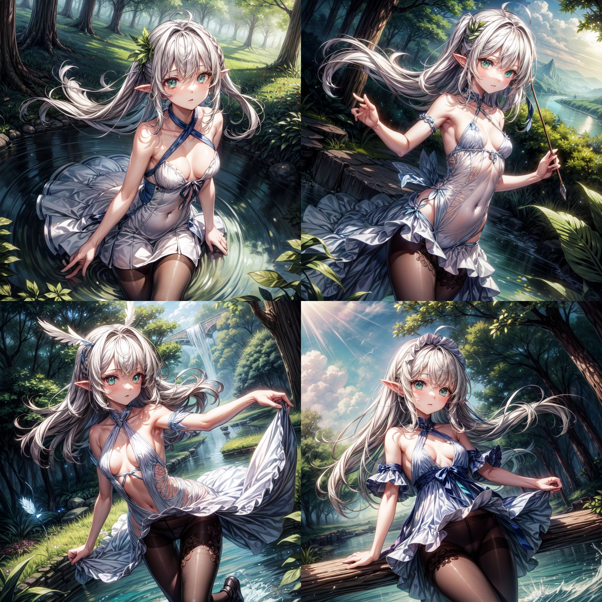
  * `黄昏法`
    ```
    (super fine illustration), (beautiful and delicate water), (beautiful and detailed eyes:1.05), (very detailed light:1.05), (perfect and delicate limbs:1.05), (nature:1.05), (painting:1.05), (water bloom:1.05), (delicate glow:1.05), (very fine 8k cg wallpaper), lavender eyes, peach pink pupils, whole body, white hair, luminous eyes, an extremely delicate and beautiful girl, (1girl), medium chest circumference, dynamic angle, (violet dress with gold decoration), (long hair floating everywhere), (beautiful hair decoration), (delicate wet dress), (nsfw), (breeze), long hair blown up, (messy hair style:1.21), (long bangs between eyes), wrinkled skirt, flowers meadow, near the water edge, (sunset:1.33), (less stars form a circle), randomly distributed clouds, (rivers), (willows with branches falling into the water),
    # 反向
    (ugly:1.15), (duplicate:1.05), (morbid), (mutilated), (tranny:1.05), mutated hands, (poorly drawn hands:1.05), blurry, (bad proportions:1.05), extra limbs, cloned face, (disfigured:1.05), (more than 2 nipples:1.05), (missing arms:1.21), (extra legs:1.15), (fused fingers:1.27), (too many fingers:1.27), (unclear eyes:1.15), lowers, error, normal quality, jpeg artifacts, signature, watermark, username, bad feet, (monotone:1.27),
    ```
    * `采样方法` `Euler a`
    * `迭代步数` `20`
    * `提示词引导系数` `4`
    * `生成`
      * `MeinaHentai`
        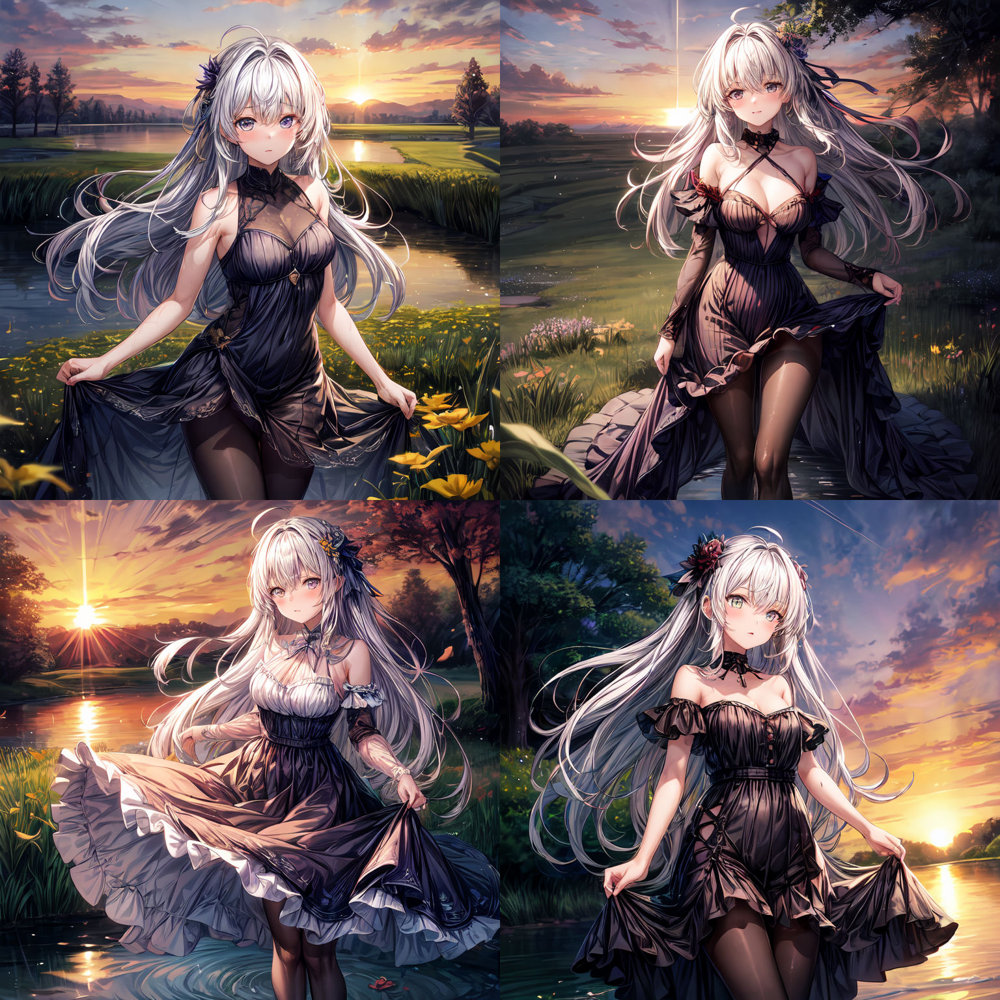
      * `Hassaku (hentai model)`
        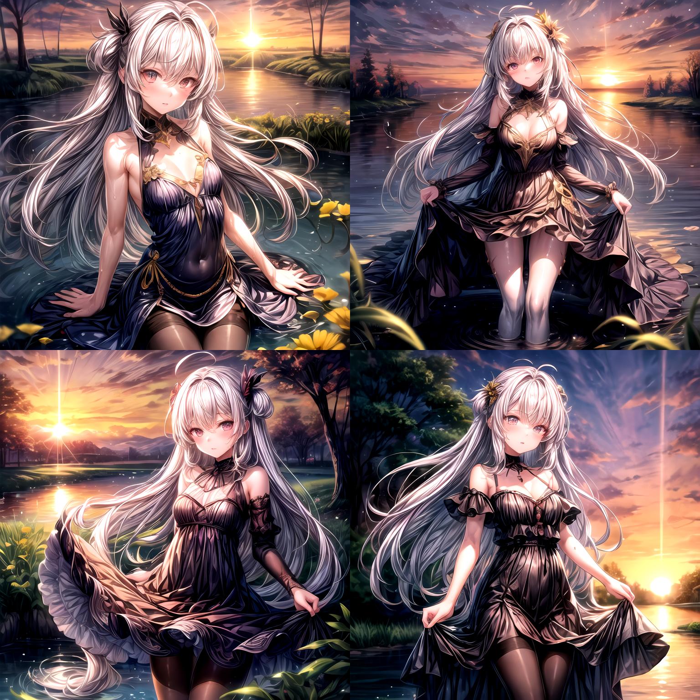
  * `结晶法`
    ```
    (crystals texture hair:1.3), (extremely detailed cg:1.2), (8k wallpaper), (crystalline purple gemstone gloves:1.2), (beautiful detailed glass hair:1.2), (glass shaped texture hand:1.2), (crystallize texture body:1.2), gem body, hands as clear as jewels, crystallization of clothes, (crystals texture skin:1.2), sparkle, lens flare, light leaks, broken glass, (detailed glass shaped clothes:1.2), (frills:1.2), (1girl), (solo), dynamic angle, big top sleeves, floating, beautiful detailed gemstone sky, gemstone sea, beautiful detailed eyes, overexposure, side blunt bangs, hairs between eyes, ribbons, bowties, buttons, bare shoulders, (small breast:1.3), pleated skirt, crystals texture flowers, (detailed crystallized clothing:1.2), (gemstone of body), solo focus,
    # 反向
    text, error, normal quality, jpeg artifacts, signature, watermark, username, blurry, artist name, bad feet, (ugly), (duplicate), (morbid), (mutilated), (tranny), mutated hands, (poorly drawn hands), (bad proportions), extra limbs, cloned face, (disfigured), (more than 2 nipples), (missing arms:1.2), (extra legs:1.2), (fusedfingers:1.2), (too many fingers:1.2), (unclear eyes), normal quality, bad,
    ```
    * `采样方法` `Euler a`
    * `迭代步数` `40`
    * `提示词引导系数` `4.5`
    * `生成`
      * `MeinaHentai`
        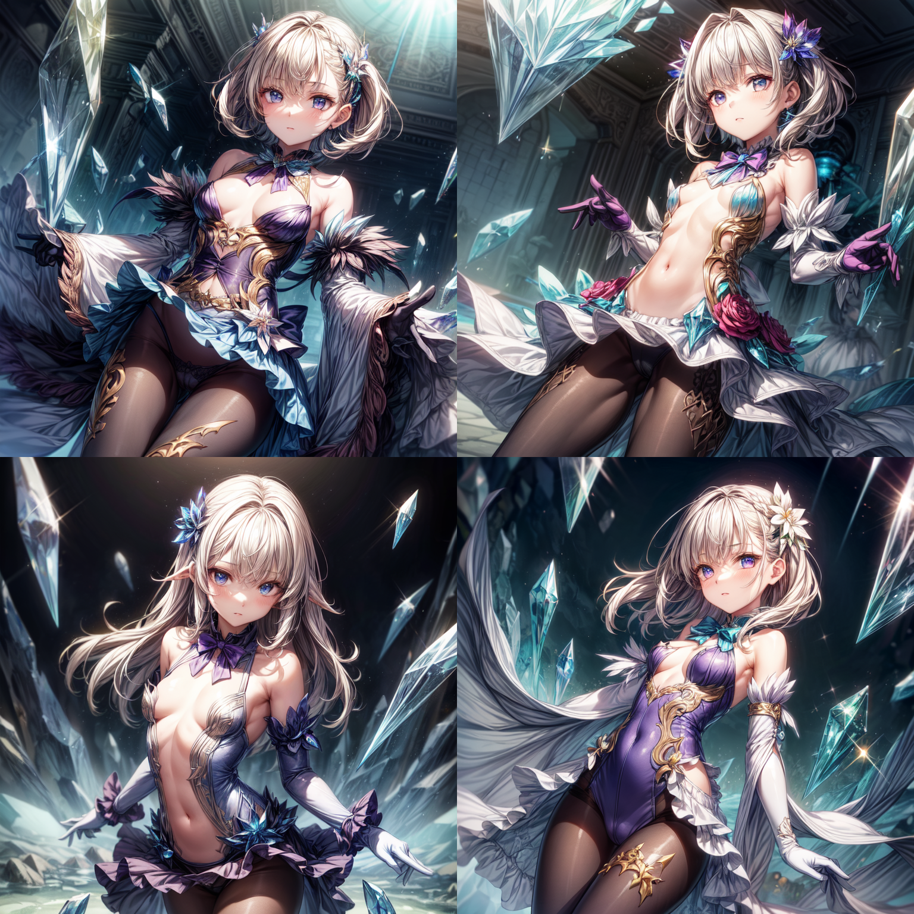
  * `雪月法`
    ```
    hiten, beautiful detailed glow, detailed ice, beautiful detailed water, red moon, snowflake, (beautiful detailed eyes), expressionless, beautiful detailed white gloves, (floating cloud:1.2), azure hair, long bangs, hairs between eyes, dark dress, (dark magician girl), black knee highs, black ribbon, white bow ties, midriff, (half closed eyes), big forehead, blank stare, flower, large top sleeves,
    # 反向
    text, error, normal quality, jpeg artifacts, signature, watermark, username, blurry, missing arms，
    ```
    * `采样方法` `Euler a`
    * `迭代步数` `50`
    * `提示词引导系数` `5.5`
    * `生成`
      * `MeinaHentai`
        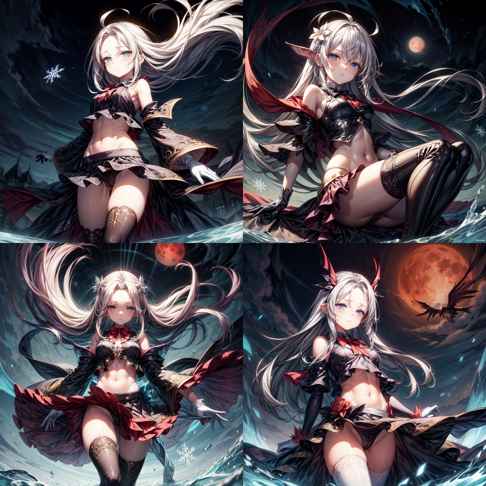
  * `城堡法`
    ```
    beautiful detailed glow, detailed ice, beautiful detailed water, red moon, (magic circle:1.2), (beautiful detailed eyes), expressionless, beautiful detailed white gloves, own hands clasped, (floating palaces:1.1), azure hair, long bangs, hairs between eyes, dark dress, (dark magician girl), black kneehighs, black ribbon, white bowties, midriff, (half-closed eyes), big forehead, blank stare, flower, large top sleeves,
    # 反向
    multiple breasts, (mutated hands and fingers:1.5), (long body:1.3), (mutation, poorly drawn:1.2), greyscale, liquid body, liquid tongue, disfigured, malformed, mutated, anatomical nonsense, text font ui, error, malformed hands, long neck, blurred, lowers, bad proportions, bad shadow, uncoordinated body, unnatural body, fused breasts, bad breasts, huge breasts, poorly drawn breasts, extra breasts, liquid breasts, heavy breasts, missing breasts, huge haunch, huge thighs, huge calf, fused hand, missing hand, disappearing arms, disappearing thigh, disappearing calf, disappearing legs, fused ears, bad ears, poorly drawn ears, extra ears, liquid ears, heavy ears, missing ears, fused animal ears, bad animal ears, poorly drawn animal ears, extra animal ears, liquid animal ears, heavy animal ears, missing animal ears, text, ui, missing limb, fused fingers, one hand with more than 5 fingers, one hand with less than 5 fingers, one hand with more than 5 digit, one hand with less than 5 digit, fused digit, missing digit, bad digit, liquid digit, colorful tongue, black tongue, watermark, username, jpeg artifacts, signature, 3d, 3d game, 3d game scene, 3d character, malformed feet, extra feet, bad feet, poorly drawn feet, fused feet, missing feet, extra shoes, bad shoes, fused shoes, more than two shoes, poorly drawn shoes, bad gloves, poorly drawn gloves, fused gloves, bad cum, poorly drawn cum, fused cum, bad hairs, poorly drawn hairs, fused hairs, big muscles, ugly, bad face, fused face, poorly drawn face, cloned face, big face, long face, bad eyes, fused eyes, poorly drawn eyes, extra eyes, malformed limbs, more than 2 nipples, missing nipples, different nipples, fused nipples, bad nipples, poorly drawn nipples, black nipples, colorful nipples, gross proportions, short arm, (missing arms:1.3), missing thighs, missing calf, missing legs, duplicate, morbid, mutilated, poorly drawn hands, more than 1 left hand, more than 1 right hand, deformed, (blurry), extra arms, extra thighs, more than 2 thighs, extra calf, fused calf, extra legs, bad knee, extra knee, more than 2 legs, bad tails, bad mouth, fused mouth, poorly drawn mouth, bad tongue, tongue within mouth, too long tongue, big mouth, cracked mouth, bad mouth, dirty face, dirty teeth,  dirty pantie, fused pantie, poorly drawn pantie, fused cloth, poorly drawn cloth, bad pantie, yellow teeth, thick lips, bad cameltoe, colorful camel toe, bad asshole, poorly drawn asshole, fused asshole, missing asshole, bad anus, bad pussy, bad crotch, bad  crotch seam, fused anus, fused pussy, fused crotch, poorly drawn crotch, fused seam, poorly drawn anus, poorly drawn pussy, poorly drawn crotch seam, bad thigh gap, missing thigh gap, fused thigh gap, liquid thigh gap, poorly drawn thigh gap, bad collarbone, fused collarbone, missing collarbone, liquid collarbone, strong girl, obesity, normal quality, liquid tentacles, bad tentacles, poorly drawn tentacles, split tentacles, fused tentacles, missing clit, bad clit, fused clit, black clit, liq,
    ```
    * `采样方法` `Euler a`
    * `迭代步数` `50`
    * `提示词引导系数` `6`
    * `生成`
      * `MeinaHentai`
        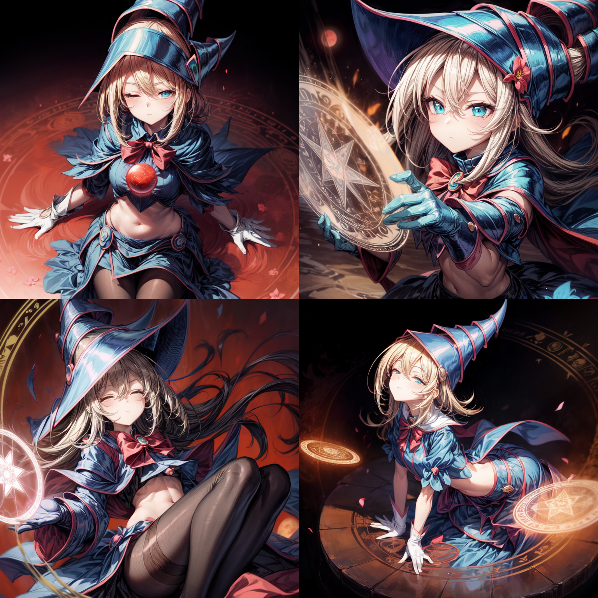
  * `火烧云`
    ```
    beautiful detailed glow, (beautiful detailed eyes), (dark magician girl), big forehead, flower, large top sleeves, floating ashes, beautiful and detailed explosion, red moon, fire, fire cloud, wings on fire, a cloudy sky, smoke of gunpowder, burning, black dress, (beautiful detailed eyes), expressionless, beautiful detailed white gloves, dove of peace, (floating cloud:1.2), azure hair, disheveled hair, long bangs, hair between eyes, black kneehighs, black ribbon, white bowties, midriff, (half-closed eyes),
    # 反向
    text, error, normal quality, jpeg artifacts, signature, watermark, username, blurry, missing arms，
    ```
    * `采样方法` `Euler a`
    * `迭代步数` `50`
    * `提示词引导系数` `5.5`
    * `生成`
      * `MeinaHentai`
        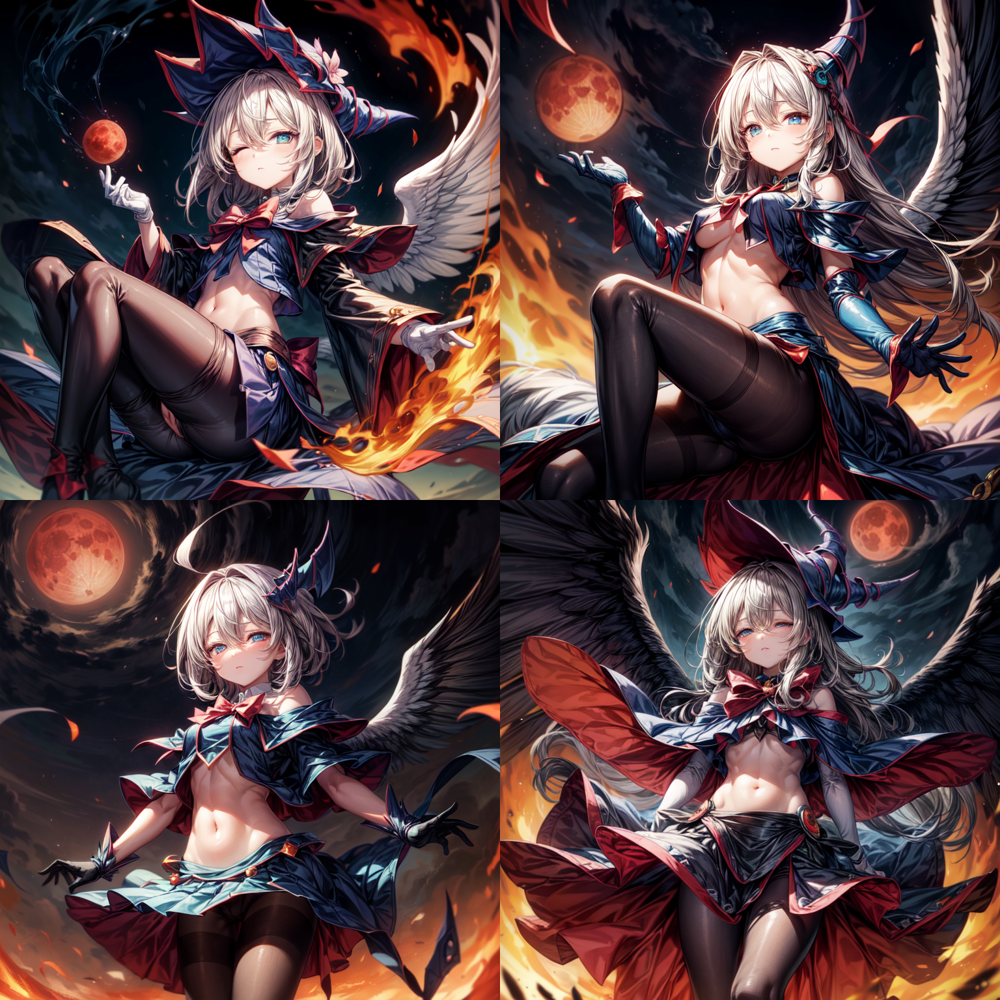
  * `星冰乐`
    ```
    (beautiful detailed girl), beautiful detailed glow, detailed ice, beautiful detailed water, (beautiful detailed eyes), expressionless, beautiful detailed white gloves, (floating palace:1.3), azure hair, disheveled hair, long bangs, hair between eyes, (sky blue dress), black ribbon, white bowties, midriff, (half-closed eyes), big forehead, blank stare, flower, large top sleeves, (ice crystal texture wings:1.3),
    # 反向
    multiple breasts, (mutated hands and fingers:1.5), (long body:1.3), (mutation, poorly drawn:1.2), greyscale, liquid body, liquid tongue, disfigured, malformed, mutated, anatomical nonsense, text font ui, error, malformed hands, long neck, blurred, lowers, bad proportions, bad shadow, uncoordinated body, unnatural body, fused breasts, bad breasts, huge breasts, poorly drawn breasts, extra breasts, liquid breasts, heavy breasts, missing breasts, huge haunch, huge thighs, huge calf, fused hand, missing hand, disappearing arms, disappearing thigh, disappearing calf, disappearing legs, fused ears, bad ears, poorly drawn ears, extra ears, liquid ears, heavy ears, missing ears, fused animal ears, bad animal ears, poorly drawn animal ears, extra animal ears, liquid animal ears, heavy animal ears, missing animal ears, text, ui, missing limb, fused fingers, one hand with more than 5 fingers, one hand with less than 5 fingers, one hand with more than 5 digit, one hand with less than 5 digit, fused digit, missing digit, bad digit, liquid digit, colorful tongue, black tongue, watermark, username, jpeg artifacts, signature, 3d, 3d game, 3d game scene, 3d character, malformed feet, extra feet, bad feet, poorly drawn feet, fused feet, missing feet, extra shoes, bad shoes, fused shoes, more than two shoes, poorly drawn shoes, bad gloves, poorly drawn gloves, fused gloves, bad cum, poorly drawn cum, fused cum, bad hairs, poorly drawn hairs, fused hairs, big muscles, ugly, bad face, fused face, poorly drawn face, cloned face, big face, long face, bad eyes, fused eyes, poorly drawn eyes, extra eyes, malformed limbs, more than 2 nipples, missing nipples, different nipples, fused nipples, bad nipples, poorly drawn nipples, black nipples, colorful nipples, gross proportions, short arm, (missing arms:1.3), missing thighs, missing calf, missing legs, duplicate, morbid, mutilated, poorly drawn hands, more than 1 left hand, more than 1 right hand, deformed, (blurry), extra arms, extra thighs, more than 2 thighs, extra calf, fused calf, extra legs, bad knee, extra knee, more than 2 legs, bad tails, bad mouth, fused mouth, poorly drawn mouth, bad tongue, tongue within mouth, too long tongue, big mouth, cracked mouth, bad mouth, dirty face, dirty teeth,  dirty pantie, fused pantie, poorly drawn pantie, fused cloth, poorly drawn cloth, bad pantie, yellow teeth, thick lips, bad cameltoe, colorful camel toe, bad asshole, poorly drawn asshole, fused asshole, missing asshole, bad anus, bad pussy, bad crotch, bad  crotch seam, fused anus, fused pussy, fused crotch, poorly drawn crotch, fused seam, poorly drawn anus, poorly drawn pussy, poorly drawn crotch seam, bad thigh gap, missing thigh gap, fused thigh gap, liquid thigh gap, poorly drawn thigh gap, bad collarbone, fused collarbone, missing collarbone, liquid collarbone, strong girl, obesity, normal quality, liquid tentacles, bad tentacles, poorly drawn tentacles, split tentacles, fused tentacles, missing clit, bad clit, fused clit, black clit, liq,
    ```
    * `采样方法` `Euler a`
    * `迭代步数` `50`
    * `提示词引导系数` `5.5`
    * `生成`
      * `MeinaHentai`
        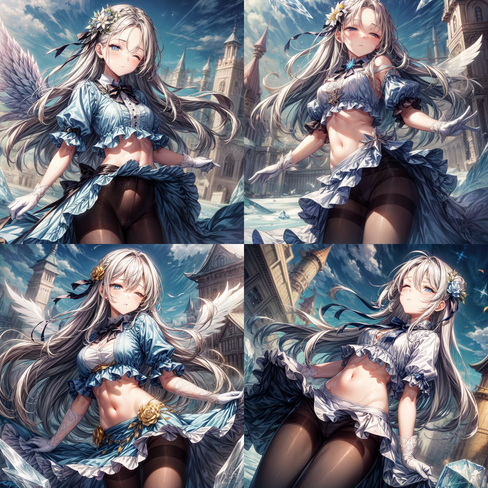
  * `暗锁法`
    ```
    (beautiful detailed girl), (beautiful detailed lighting:1.3), beautiful detailed eyes, (disheveled hair:1.6), (beautiful detailed dress), midriff, (female girl), (off-shoulder jacket:1.2), sailor dress, (darkside:1.4), (bust:1.4), (watercolor (medium):1.6), whole black bloomer, wet clothes, wet skin, flowers, hollow eyes, hollow night, hollow knight, (chain:1.6), dark soul, abyssal ship, deep dark, darkness, (female girl:1.4), (small breasts:1.3), death garden, (emotionless eyes:1.4), (cthulhu), (extremely detailed dark clouds:), (extremely detailed cg unity 8k wallpaper:1.6), (extremely detailed face:1.3), (chain storm:1.6), (chain ring:1.2),
    # 反向
    (ugly), (duplicate), (morbid), (mutilated), (tranny:1.5), mutated hands, oorly drawn  hands, blurry, (bad proportions:0.9), extra limb, cloned face, (disfigured), (more than 2 nipples), (missing arms:1.4), (extra legs), mutated hands, (fused fingers:1.6), (too many fingers:1.6), (unclear eyes), text, error, normal quality, jpeg artifacts, signature, watermark, username, bad feet,
    ```
    * `采样方法` `Euler`
    * `迭代步数` `24`
    * `提示词引导系数` `4.5`
    * `生成`
      * `MeinaHentai`
        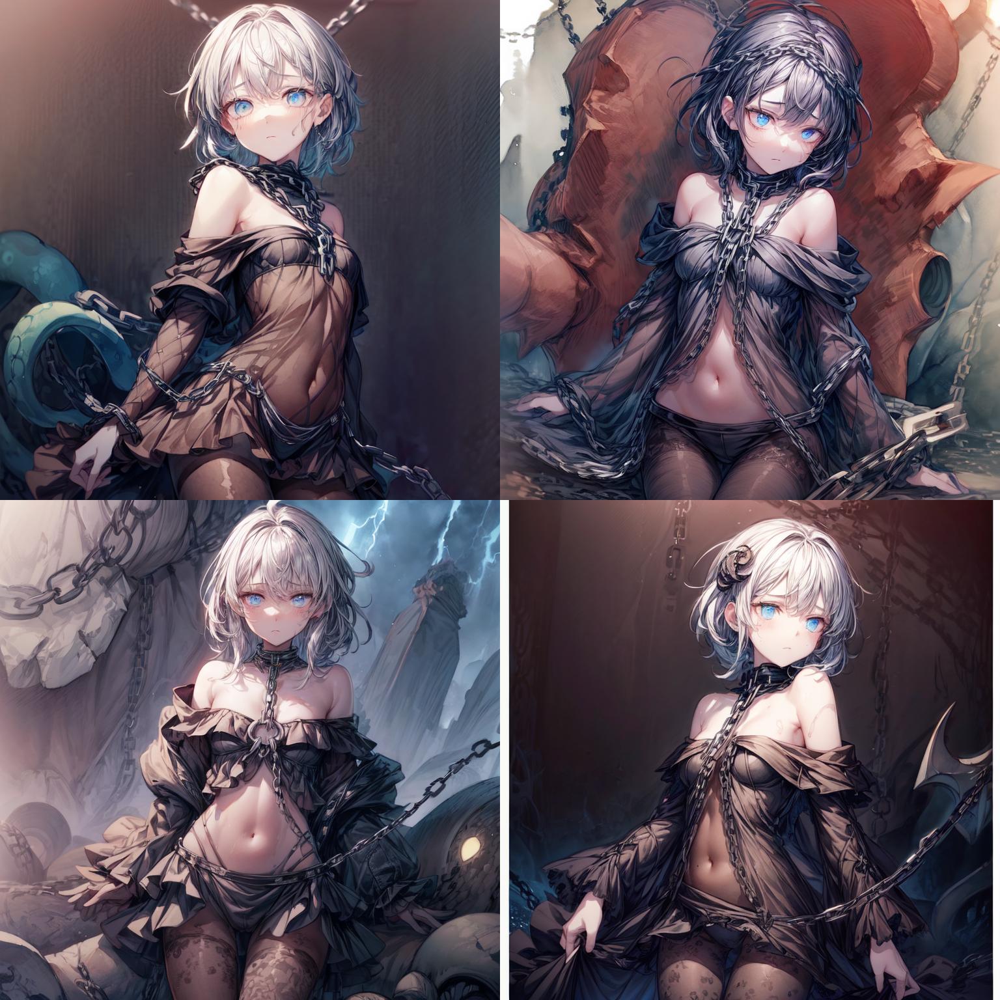
  * `虹彩法`
    ```
    (extremely detailed cg:1.2), (8k wallpaper:1.2), watercolor (medium), (beautiful detailed starry sky:1.2), cinmatic lighting, loli, princess, very long rainbow hair, side view, looking at viewer, full body, frills, (far from viewer), (extremely detailed face:1.2), (an extremely delicate and beautiful girl:1.2), (extremely detailed cute anime face:1.2), (extremely detailed eyes:1.2), (extremely detailed body:1.3), (ultra detailed), (bare stomach:1.2), (bare shoulders:1.2), small breasts, (sideboob:1.2), (floating and rainbow hair:1.4), (iridescence and rainbow hair:1.3), (extremely detailed sailor dress:1.3) (iridescence and rainbow dress:1.4), (iridescence and rainbow eyes), beautiful detailed hair, beautiful detailed dress, dramatic angle, expressionless, (big top sleeves), blush, (ahoge),
    # 反向
    text, error, ugly, duplicate, morbid, boken limb, incorrect limb, fusion finger, lose finger, multiple finger, multiple digit, fusion hand, lose leg, fused leg, multiple leg, bad feet, normal quality, simple background, jpeg,
    ```
    * `采样方法` `Euler a`
    * `迭代步数` `28`
    * `提示词引导系数` `5`
    * `生成`
      * `MeinaHentai`
        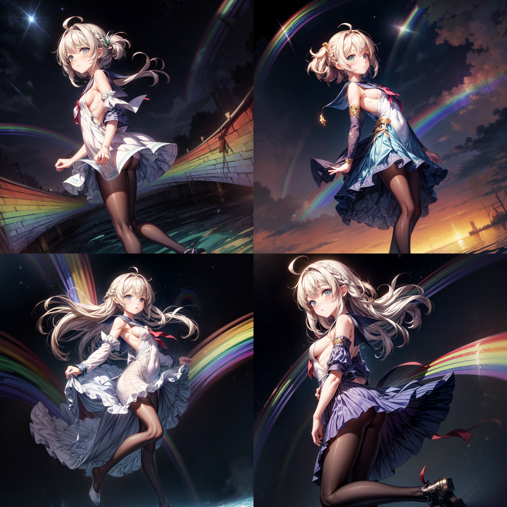
  * `融合法`
    ```
    1girl, phoenix girl, fluffy hair, war, a hell on earth, beautiful and detailed explosion, cold machine, fire in eyes, world war, burning, metal texture, exquisite clothing, metal carving, volume, normal hands, metal details, metal scratch, metal defects, official art, 4k, extremely detailed cg unity 8k, highres, contour deepening, azur lane, girls front, magical, loud map plan, long-focus, depth of field, a cloudy sky, black smoke, smoke of gunpowder, mature, resolute eyes, burning sky, burning hair, burn oneself in flames, fighting, covered in blood, complex pattern, battling, flying flames, flame whirlpool, doomsday scenes, float, splashing blood, on the battlefield, bloody scenes, good looking flame, exquisite flame, exquisite blood, photorealistic, watercolor, colourful, beautiful detailed glow, detailed ice, beautiful detailed water, red moon, (magic circle:1,2),(beautiful detailed eyes), expressionless, beautiful detailed white gloves, own hands clasped, azure hair, disheveled hair, long bangs, hair between eyes, dark dress, (dark magician girl:), black kneehighs, black ribbon, white bowties, midriff,(half-closed eyes), big forehead, blank stare, flower, large top sleeves, (beautiful detailed girl), (floating palace:1.2), (sky blue dress), (ice crystal texture wings:1.2), (ice and fire melt:1.3),
    # 反向
    (ugly:1.3), (duplicate:1.3), (morbid:1.2), (mutilated:1.2), (tranny:1.3), mutated hands, (poorly drawn hands:1.3), blurry, (bad proportions:1.3), extra limbs, cloned face(disfigured:1.3), (more than 2 nipples:1.3), (missing arms:1.4), (extra legs:1.3), (fused fingers:1.6), (too many fingers:1.6), (unclear eyes:1.3), text, error, normal quality, jpeg artifacts, signature, watermark, username, bad feet, text font ui, malformed hands, long neck, missing limb, (mutated hand and finger: 1.5), (mutation poorly drawn: 1.2), malformed mutated, multiple breasts, futa, yaoi,
    ```
    * `采样方法` `Euler`
    * `迭代步数` `39`
    * `提示词引导系数` `4.5`
    * `生成`
      * `MeinaHentai`
        
  * `冰系改`
    ```
    (beautiful detailed girl), beautiful detailed glow, detailed ice, beautiful detailed water, (beautiful detailed eyes), expressionless, beautiful detailed white gloves, (floating palace:1.2), azure hair, disheveled hair, long bangs, hair between eyes, (sky blue dress), black ribbon, white bowtie, midriff, (half-closed eyes), big forehead, blank stare, flower, large top sleeves, (ice crystal texture wings:1.3), (iridescence and rainbow hair:1.7), (detailed cute anime face:1.6), (loli), (watercolor (medium):1.2),
    # 反向提示词
    (ugly), (duplicate), (morbid), (mutilated), (tranny), mutated hands, (poorly drawn hands), blurry, (bad proportions), extra limb, cloned face, (disfigured), (more than 2 nipples), (missing arms:1.2), (extra legs), mutated hands, (fused fingers:1.2), (too many fingers:1.2), (unclear eyes), text, error, normal quality, jpeg artifacts, signature, watermark, username, blurry, bad,
    ```
    * `采样方法` `DPM++ 2M Karras`
    * `迭代步数` `20`
    * `提示词引导系数` `7`
    * `生成`
      * `MeinaHentai`
        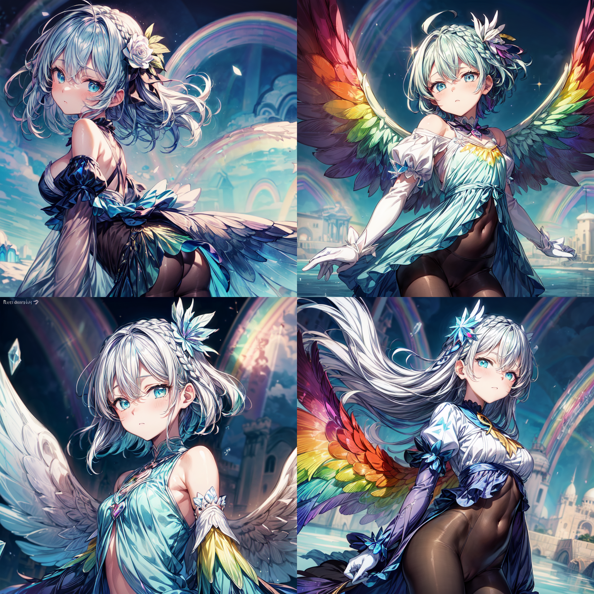
  * `自然法`
    ```
    (super fine illustration, beautiful and delicate water), (the finest grass:1.2), (beautiful eyes), very delicate light, perfect and delicate limb, nature, painting, water spray,(fine luminescence, very fine 8k cg wallpaper), lavender eyes, pink pupils, whole body, white hair, bright eyes, (an extremely delicate and beautiful girl:1.2), (1girl:1.2), medium bust, dynamic angle, (white dress with gold decoration), (long hair flowing with the wind, beautiful hair ornaments, delicate wet skirt, breeze, long hair between eyes), wrinkled skirt, (staring blankly, lovely big eyes), messy hair, payot, lateral braid, (tulle lace white skirt), flowers and grass meadow, near the water edge, (sunset, starry sky in a circle), randomly distributed clouds, (river:1.3), splashing water, falling petals,
    # 反向提示词
    multiple breasts, (mutated hands and fingers:1.5), (long body:1.3), (mutation, poorly drawn:1.2), multi foot, (Multifold), Multi fingering, colored sclera, monster girl, black hands, greyscale, the background is incoherent, more than 2 thighs, huge thighs, huge calf, fused hand, missing hand, disappearing arms, disappearing thigh, disappearing calf, disappearing legs, fused fingers, one hand with more than 5 fingers, one hand with less than 5 fingers, bad asshole, fused asshole, missing asshole, bad anus, bad pussy, bad crotch, bad crotch seam, fused anus, fused pussy, (abnormal eye proportion), (abnormal hands), (abnormal legs), (abnormal feet abnormal fingers), (sharp face),
    ```
    * `采样方法` `Euler a`
    * `迭代步数` `30`
    * `提示词引导系数` `4`
    * `生成`
      * `MeinaHentai`
        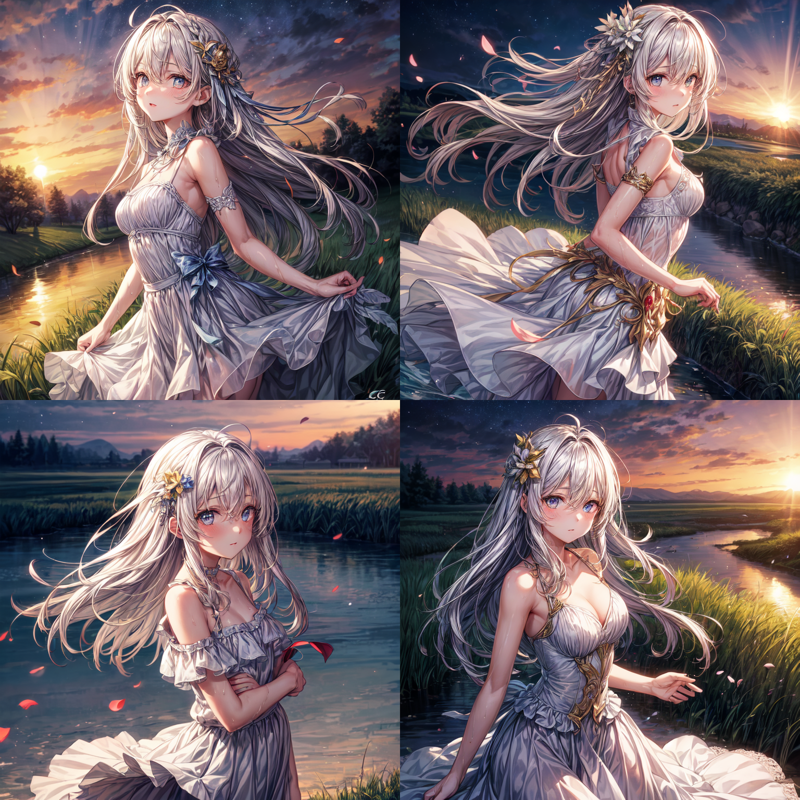
  * `苇名法`
    ```
    dramatic shadow, ray tracing, (beautiful detailed dark midnight sky:1.3), (yellow full moon:1.4), (holding wine gourd), (surrounded by floating sakura:1.6), dramatic angle, (leaning on huge stone), (bareshoulders:1.3), (very close to viewer:1.4), (tipsy:1.3), (sleepy:1.3), (far from viewer:1.2), (extremely beautiful detailed anime face and eyes:1.3),(1girl:1.7), (open hakama:1.4), (samurai:1.2), (ink), depth of field, (beautiful detailed pampas grass field:1.6), watercolor, (upper body:1.2), medium breasts, (bright eyes), (messy white long hair:1.2),
    # 反向提示词
    normal quality, jpeg artifacts, signature, watermark, username, blurry, artist name, bad feet, more than 1 moon,
    ```
    * `采样方法` `DPM++ 2M Karras`
    * `迭代步数` `20`
    * `提示词引导系数` `7`
    * `生成`
      * `MeinaHentai`
        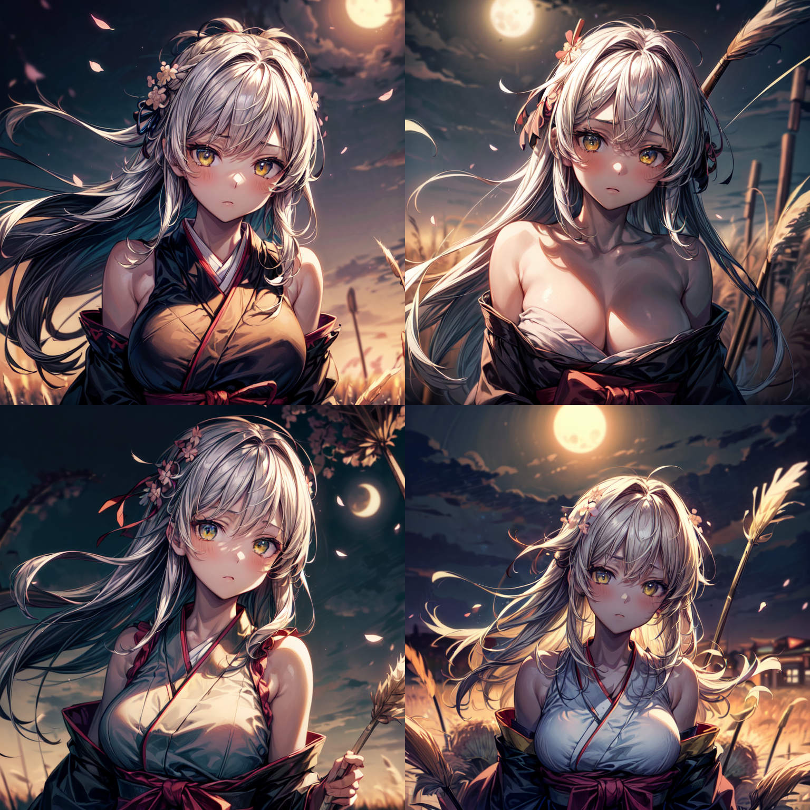
  * `圣光法`
    ```
    (detailed light), (an extremely delicate and beautiful:1.2), (beautiful detailed eyes), (sunlight), (angel), solo, young girls, dynamic angle, floating, bare shoulders, looking at viewer, wings, arms up, halo, floating white silk, (holy light) ,just like silver stars imploding we absorb the light of day,
    # 反向提示词
    text, error, normal quality, jpeg artifacts, signature, watermark, username, blurry,missing arms, large breasts,
    ```
    * `采样方法` `Euler a`
    * `迭代步数` `36`
    * `提示词引导系数` `7`
    * `生成`
      * `MeinaHentai`
        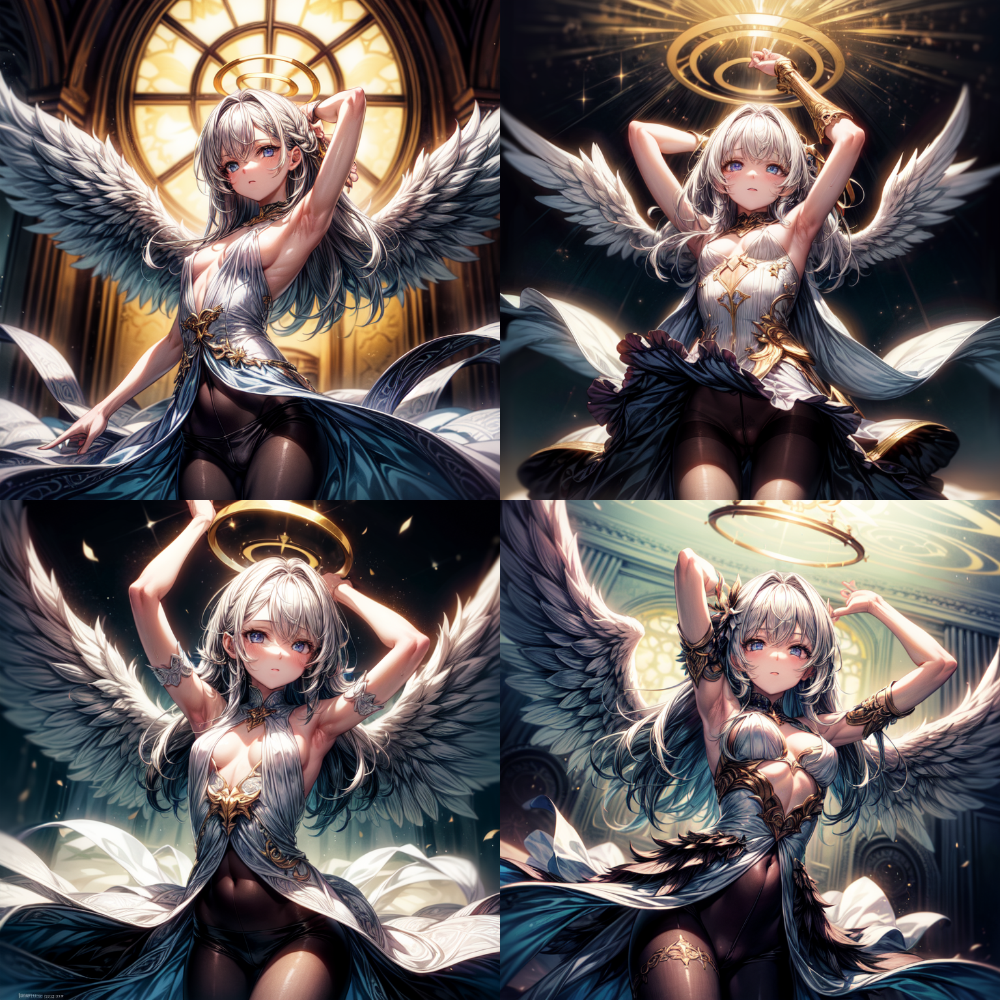
  * `幻之时`
    ```
    (1girl), amazing, beautiful detailed eyes, finely detail, depth of field, extremely detailed cg, original, extremely detailed wallpaper, loli, white hair, magic circle, cat ears, long hair, yellow eyes, wand, pentagram, clock,
    # 反向提示词
    text, error, normal quality, jpeg artifacts, signature, watermark, username, blurry,
    ```
    * `采样方法` `Euler a`
    * `迭代步数` `20`
    * `提示词引导系数` `7`
    * `生成`
      * `MeinaHentai`
        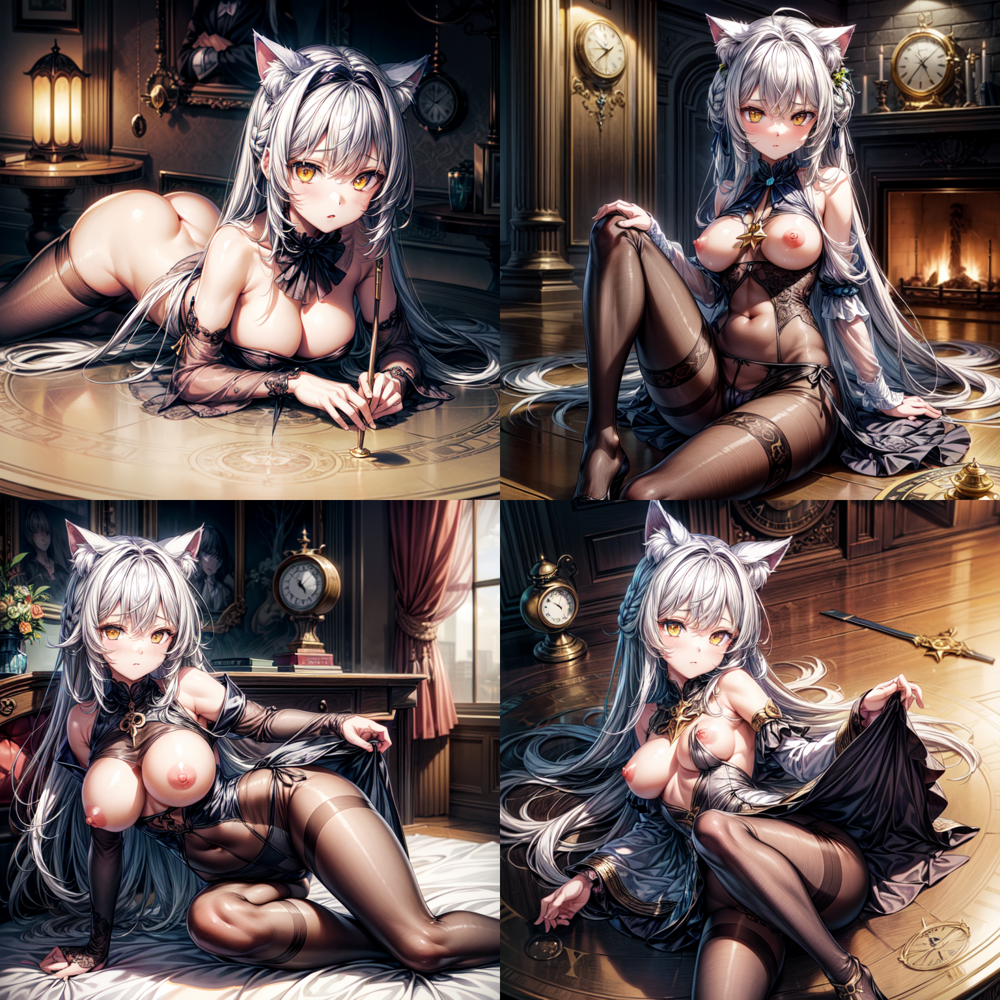
      * `Flat-2D Animerge`
        
  * `森林冰`
    ```
    (ink:1.3), (watercolor:1.2), world masterpiece theater, depth of field, (1girl), anime face, medium breasts, floating, beautiful detailed sky, looking at viewer, an detailed organdie dress, very close to viewer, bare shoulders, golden bracelet, focus on face, messy long hair, veil, upper body, lens flare, light leaks, detailed beautiful snow forest with trees, spirit, grey hair, white clothes, (snowflakes:1.2), floating sand flow, navel, (beautiful detailed eyes), (8k wallpaper),
    # 反向提示词
    text, error, normal quality, jpeg artifacts, signature, watermark, username, blurry, missing arms, long neck, humpbacked, glasses,
    ```
    * `采样方法` `Euler a`
    * `迭代步数` `30`
    * `提示词引导系数` `7`
    * `生成`
      * `MeinaHentai`
        
      * `Flat-2D Animerge`
        
  * `机凯种`
    ```
    (flat chest best quality), (highres), solo, flat chest, a girl inside the church with white hair and blue pupil surrounded by (many) glowing (feathers) in cold face, detailed face, night with bright colorful lights with richly layered clouds and clouded moon in the detailed sky, (a lot of glowing particles), high ponytail, mecha clothes, robot girl, cool movement, silver bodysuit, (filigree), delicate and (intricate) hair, (silver:1.2)and (broken) body, blue streaked hair, full body, depth of field, sitting on a (blue star),
    # 反向提示词
    bad leg, bad hands, text, error, normal quality, jpeg artifacts, signature, watermark, username, blurry, bad feet, artist name, bad body, bad proportions, optical illusion,
    ```
    * `采样方法` `Euler a`
    * `迭代步数` `28`
    * `提示词引导系数` `12`
    * `生成`
      * `MeinaHentai`
        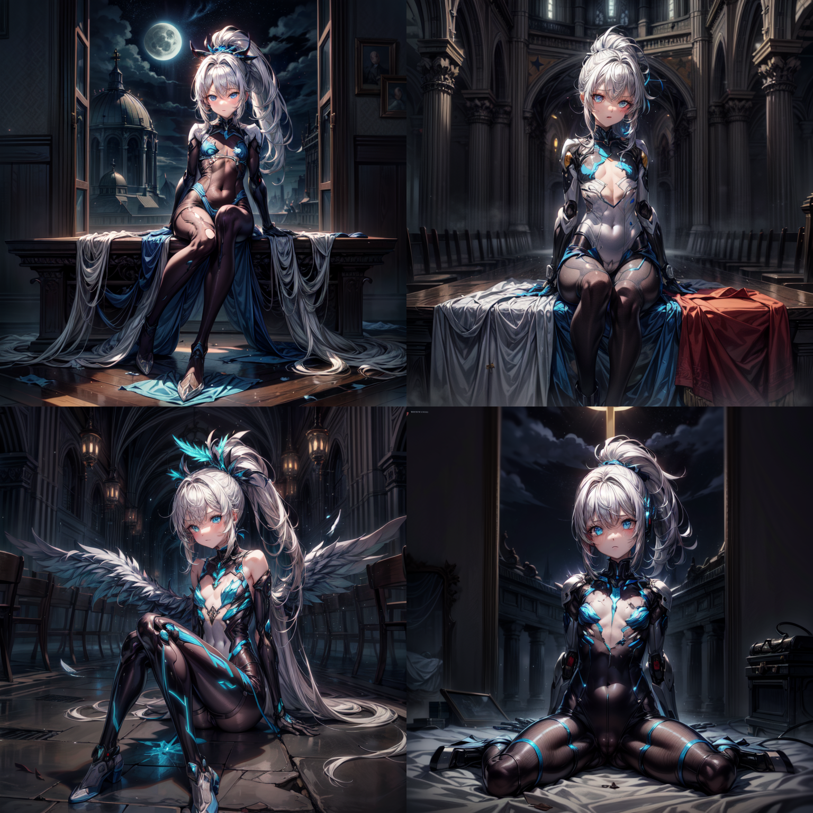
      * `Flat-2D Animerge`
        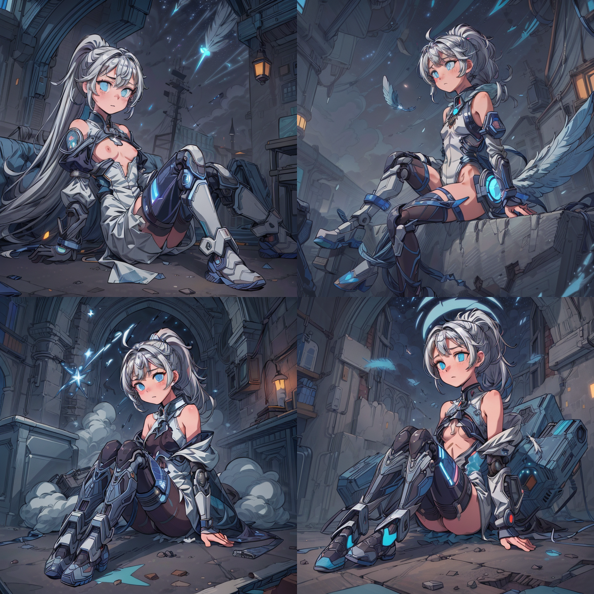
  * `星空法`
    ```
    (disheveled hair:1.2), beautiful detailed eyes, (1girl:1.2), (solo), dynamic angle, dark magician girl, (black kneehighs), (starry tornado:1.4), starry nebula, (frills:1.2), beautiful detailed sky, beautiful detailed eyes, evil smile, expressionless, hair between eyes, white hair, pleated skirt,
    # 反向提示词
    normal quality, jpeg artifacts, signature, watermark, username, blurry, bad hands, missing arms,
    ```
    * `采样方法` `Euler a`
    * `迭代步数` `50`
    * `提示词引导系数` `6`
    * `生成`
      * `MeinaHentai`
        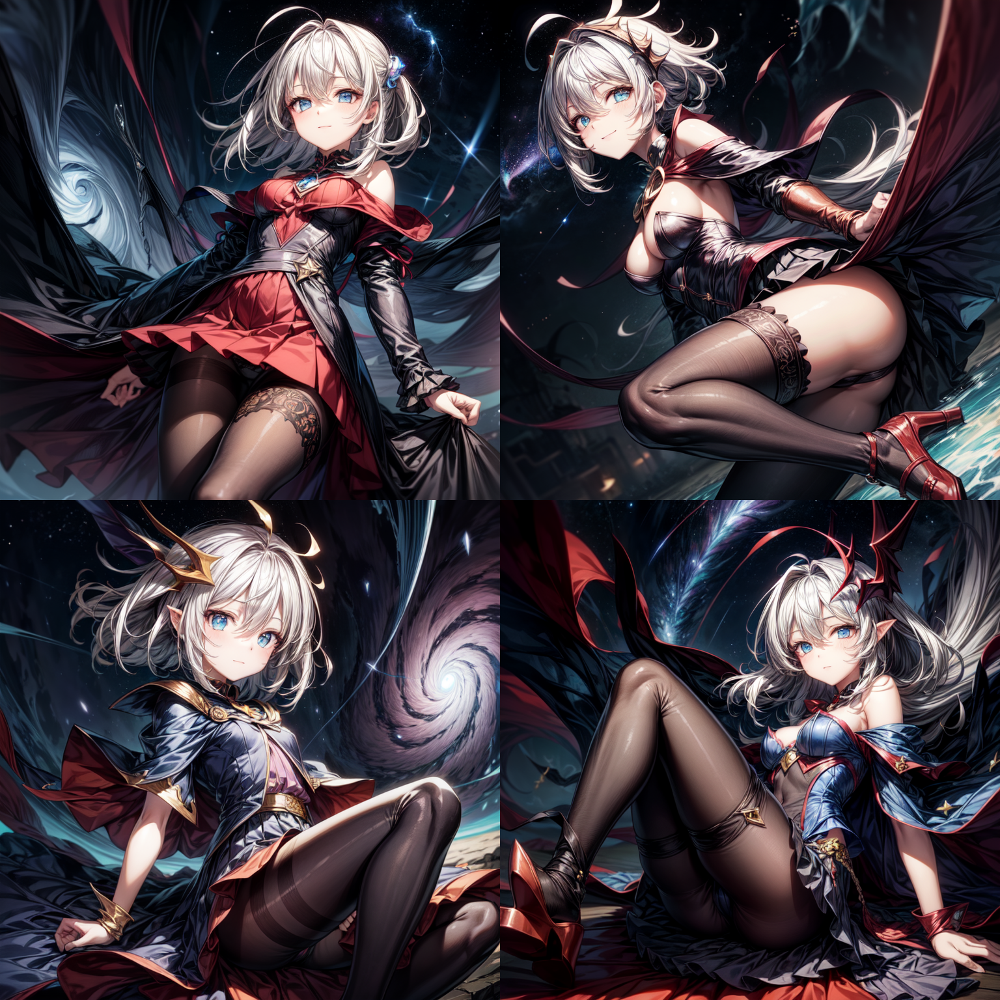
      * `Flat-2D Animerge`
        
  * `白骨法`
    ```
    cinematic lighting, (single human girl:1.2), (upper body:1.6), (extremely detailed eyes and face:1.2), (church:1.2), (annoyed:1.2), (ink:1.2), depth of field, (frown:1.2), (anime face:1.2), (skull on dress), (yokozuwari:1.3), (detailed skeleton church:1.2), (beautiful detailed black gothic empire waist dress:1.3), (dramatic angle:1.3), medium breasts, (8k wallpaper), (bright eyes:1.2), (looking at viewer), (close to viewer:1.2),(messy_long_hair:1.6), (1girl:1.6), lens flare, light leaks,
    # 反向提示词
    text, error, normal quality, jpeg artifacts, signature, watermark, username, blurry, artist name, bad feet, skeleton girl,
    ```
    * `采样方法` `Euler a`
    * `迭代步数` `27`
    * `提示词引导系数` `6.5`
    * `生成`
      * `MeinaHentai`
        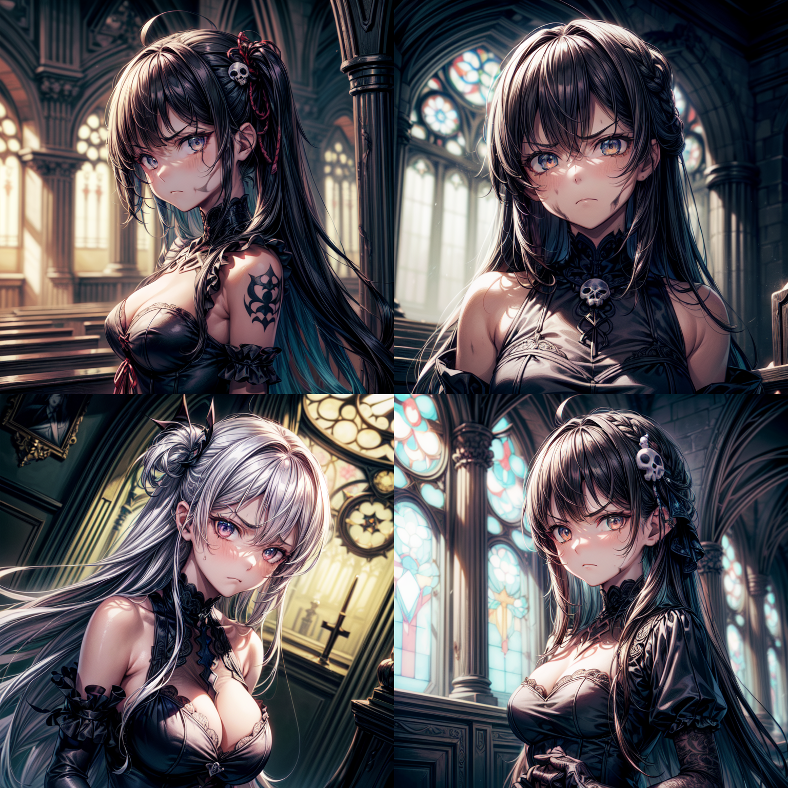
      * `Flat-2D Animerge`
        
  * `流沙法`
    ```
    cinematic lighting, (extremely detailed eyes and face:1.2), (ink:1.4), depth of field,(extremely detailed:1.2), (watercolor:1.2), (anime face:1.2), (dramatic angle:1.3), medium breast, (8k wallpaper), (bright eyes:1.2), (looking at viewer ), (an detailed  organdie dress), (very close to viewer:1.6), (sleepy:1.2), (surrounded by heavy floating sand flow and floating sharp stones:1.7), (messy long hair:1.6), (veil:1.4), focus on face, (upper body), (bare shoulders), (1girl:1.4), (golden bracelet), (long yarn), (sunset:1.2), lens flare, light leaks, (detailed beautiful desert with cactus:1.2), medium wind, (detailed beautiful sky),
    # 反向提示词
    text, error, normal quality, jpeg artifacts, signature, watermark, username, blurry, artist name, bad feet, skeleton girl,
    ```
    * `采样方法` `Euler a`
    * `迭代步数` `27`
    * `提示词引导系数` `5.5`
    * `生成`
      * `MeinaHentai`
        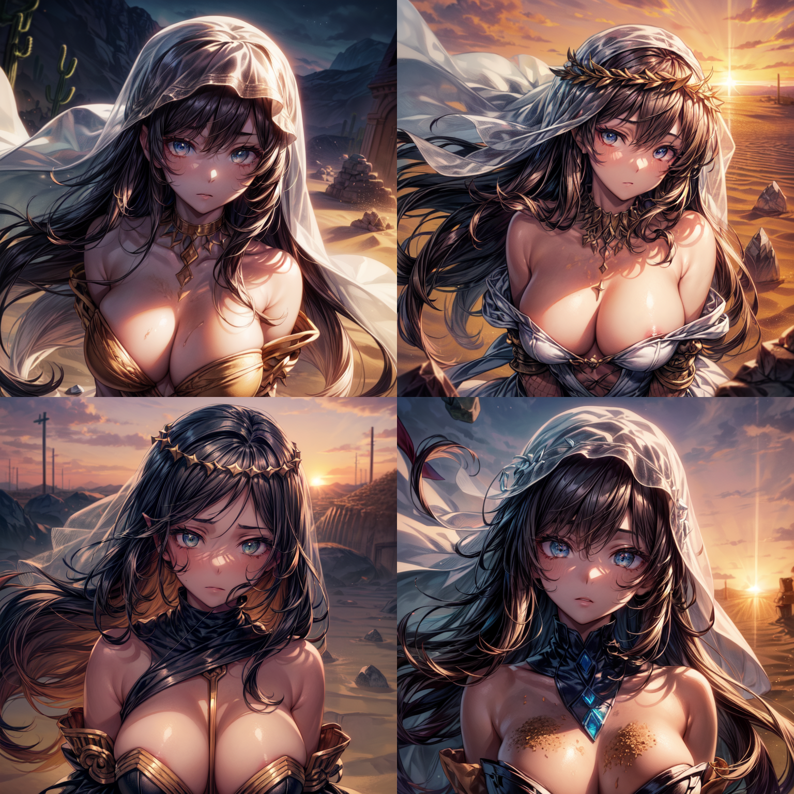
      * `Flat-2D Animerge`
        
  * `风魔法`
    ```
    (1girl), (solo), (an extremely delicate and beautiful:1.2), little girl, (beautiful detailed sky:1.2), beautiful detailed eyes, blunt side bangs, hair between eyes, ribbon, bowtie, buttons, bare shoulders, (small breasts), blank stare, pleated skirt, close to viewer, (breeze:1.2), flying splash, falling petals, wind,
    # 反向提示词
    text, error, normal quality, jpeg artifacts, signature, watermark, username, blurry, missing arms, long neck, humpbacked, shadow,
    ```
    * `采样方法` `Euler`
    * `迭代步数` `50`
    * `提示词引导系数` `5.5`
    * `生成`
      * `MeinaHentai`
        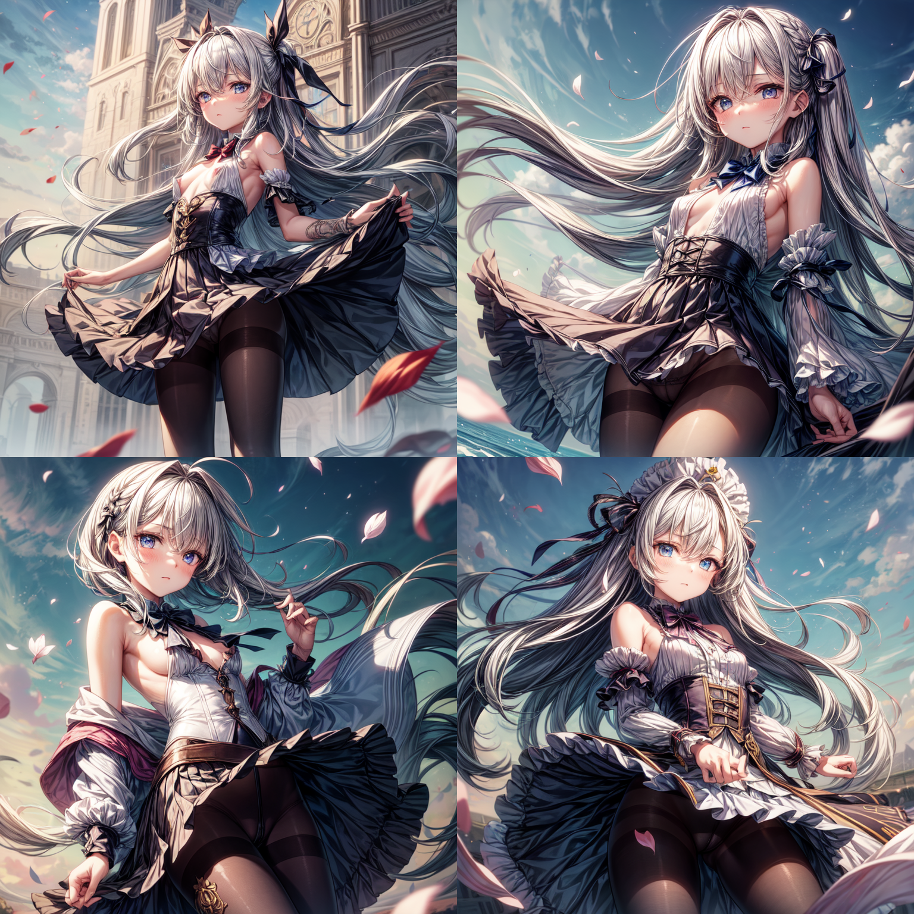
      * `Flat-2D Animerge`
        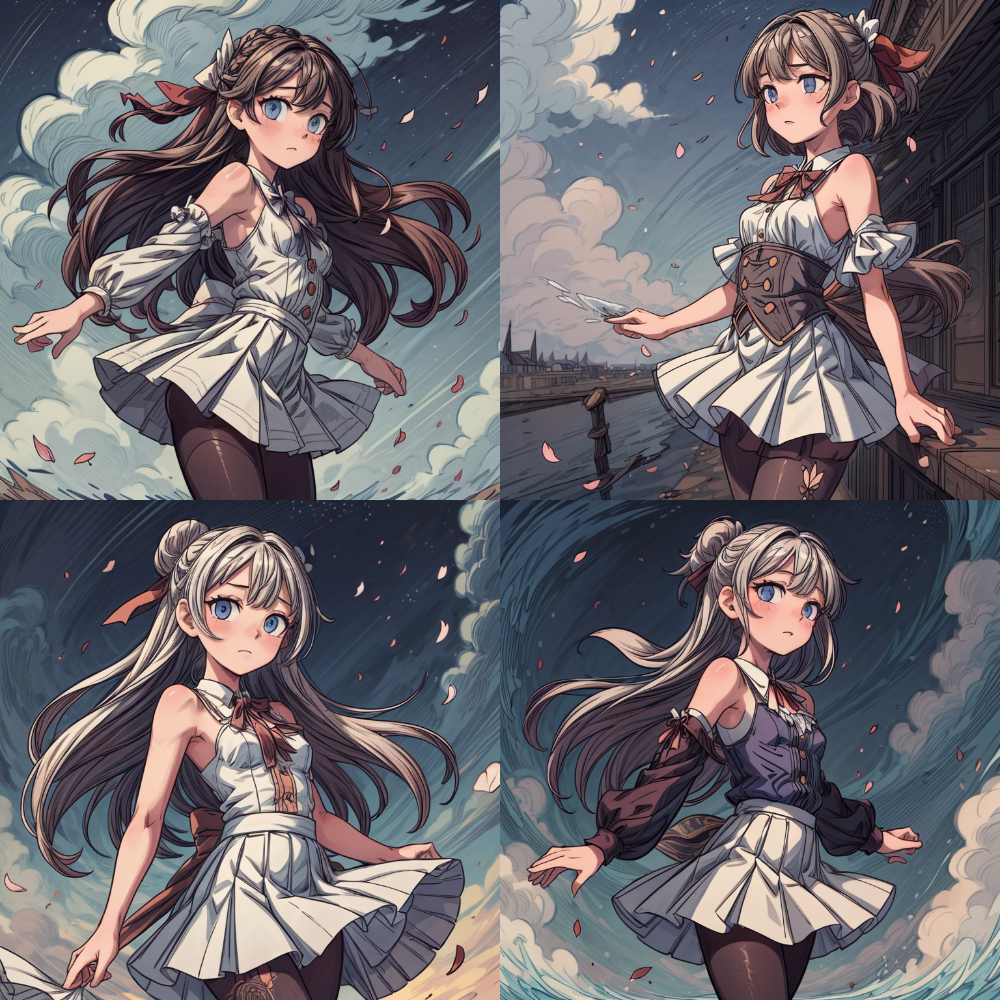
  * `核爆法`
    ```
    (beautiful detailed girl), beautiful detailed glow, (flames of war:1.2), (nuclear explosion behide:1.3), rain, detailed lighting, detailed water, (beautiful detailed eyes), expressionless, palace, azure hair, disheveled hair, long bangs, hair between eyes, (white grey dress), black ribbon, white bowtie, midriff, big forehead, blank stare, flower, long sleeves,
    # 反向提示词
    text, error, normal quality, jpeg artifacts, signature, watermark, username, blurry, missing arms, large breasts,
    ```
    * `采样方法` `Euler a`
    * `迭代步数` `28`
    * `提示词引导系数` `7`
    * `生成`
      * `MeinaHentai`
        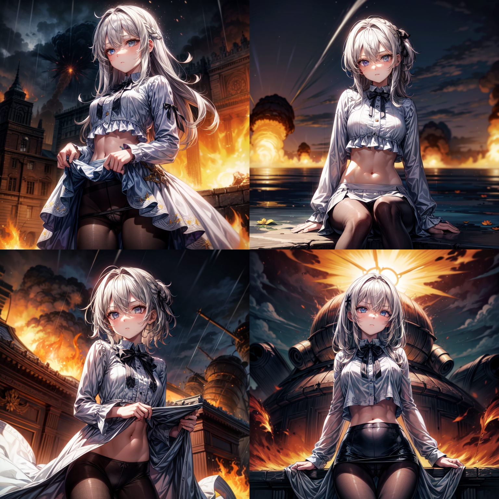
      * `Flat-2D Animerge`
        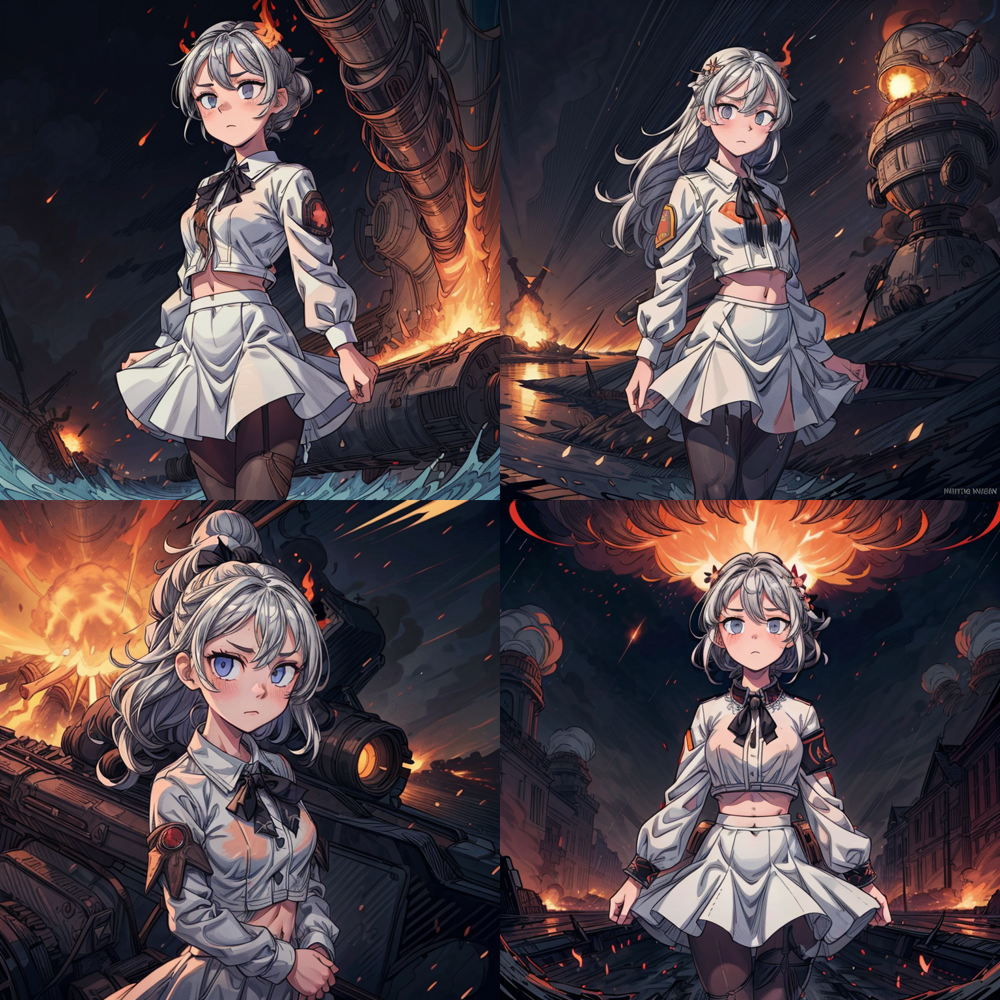
  * `冰魔法`
    ```
    (beautifuldetailed girl), beautiful detailed glow, detailed ice, beautiful detailed water, (beautiful detailed eyes), expressionless, (floating palace), azure hair, long bangs, hair between eyes, (sky blue dress), black ribbon, white bowtie, midriff, (half-closed eyes), big forehead, blank stare, flower, large top sleeves,
    # 反向提示词
    text, error, normal quality, jpeg artifacts, signature, watermark, username, blurry, missing arms, large breasts,
    ```
    * `采样方法` `Euler a`
    * `迭代步数` `27`
    * `提示词引导系数` `7`
    * `生成`
      * `MeinaHentai`
        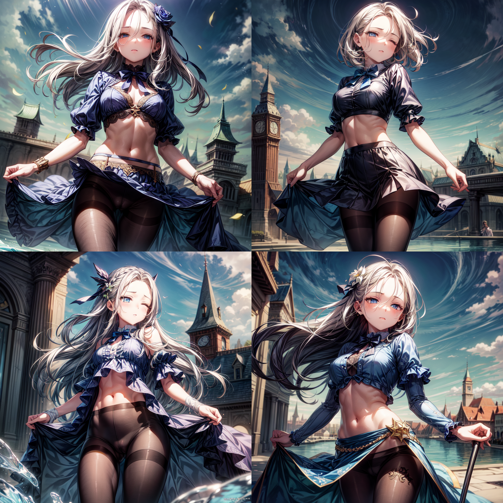
      * `Flat-2D Animerge`
        
  * `空间法`
    ```
    (floating hair:1.2), (chromatic aberration:1.2), (caustic:1.2), lens flare, (portrait:1.2), (1girl), (solo:1.2), cute face, (hidden hands:1.2), asymmetrical bangs, (beautiful detailed eyes), eyeshadow, (huge clocks:1.2), (glass strip:1.2), (floating glass fragments), (colorful refraction:1.2), (beautiful detailed sky), (dark intense shadows:1.2), (cinematic lighting:1.2), (overexposure:1.2), (expressionless), blank stare, big top sleeves, (frills:1.2), hair ornament, ribbon, bowtie, buttons, (small breasts:1.3), pleated skirt, (sharp focus:1.2), (extremely detailed:1.2), colorful, hdr,
    # 反向提示词
    text, error, standard quality, jpeg artifacts, signature, watermark, username, blurry,
    ```
    * `采样方法` `Euler a`
    * `迭代步数` `28`
    * `提示词引导系数` `4.5`
    * `生成`
      * `MeinaHentai`
        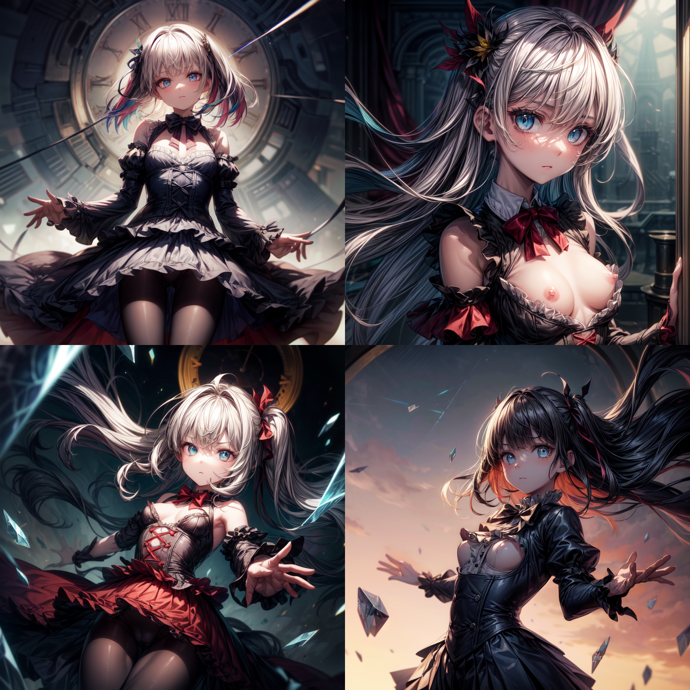
      * `Flat-2D Animerge`
        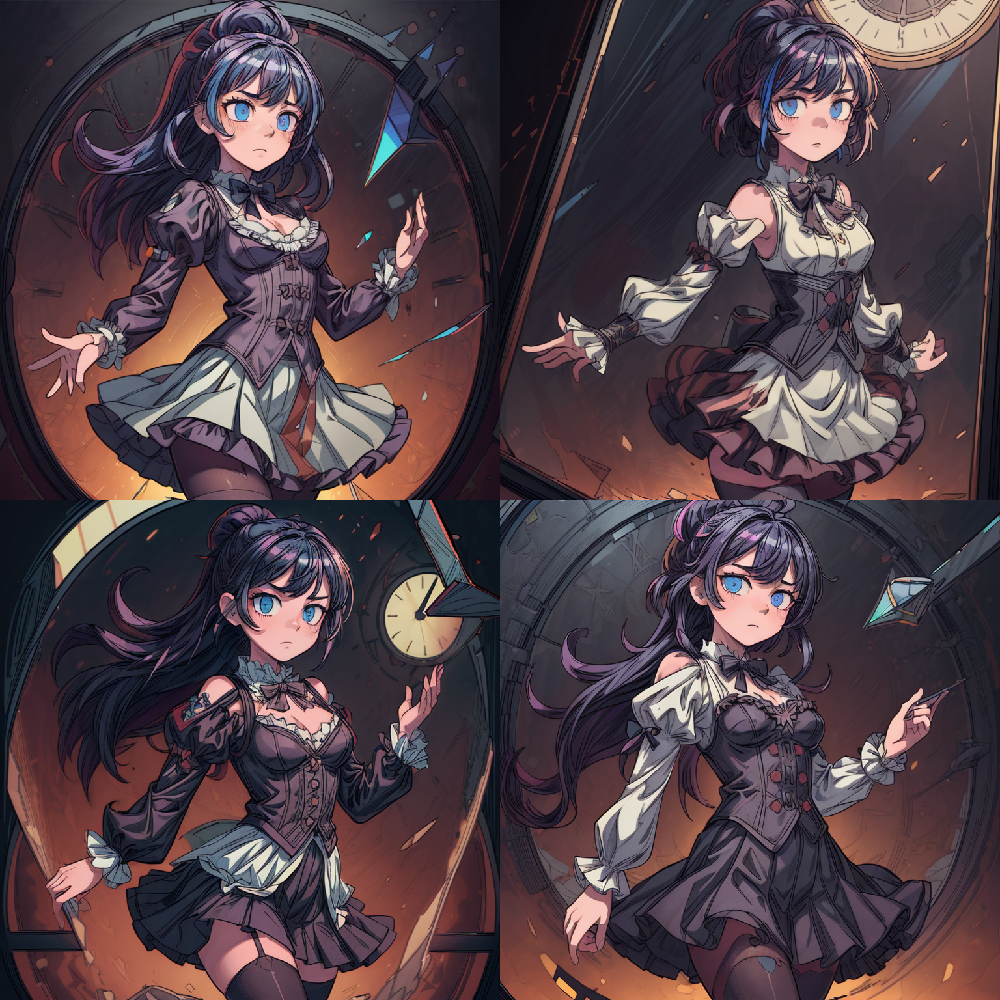
  * `水魔法`
    ```
    (frills:1.2), (1girl), (solo), dynamic angle, big top sleeves, floating, beautiful detailed sky, on beautiful detailed water, beautiful detailed eyes, overexposure, (fist), expressionless, blunt side bangs, hair between eyes, ribbon, bowtie, buttons, bare shoulders, (small breasts:1.3), detailed wet clothes, blank stare, pleated skirt, flower,
    # 反向提示词
    text, error, normal quality, jpeg artifacts, signature, watermark, username, blurry, missing arms, long neck, humpbacked,
    ```
    * `采样方法` `Euler a`
    * `迭代步数` `30`
    * `提示词引导系数` `5.5`
    * `生成`
      * `MeinaHentai`
        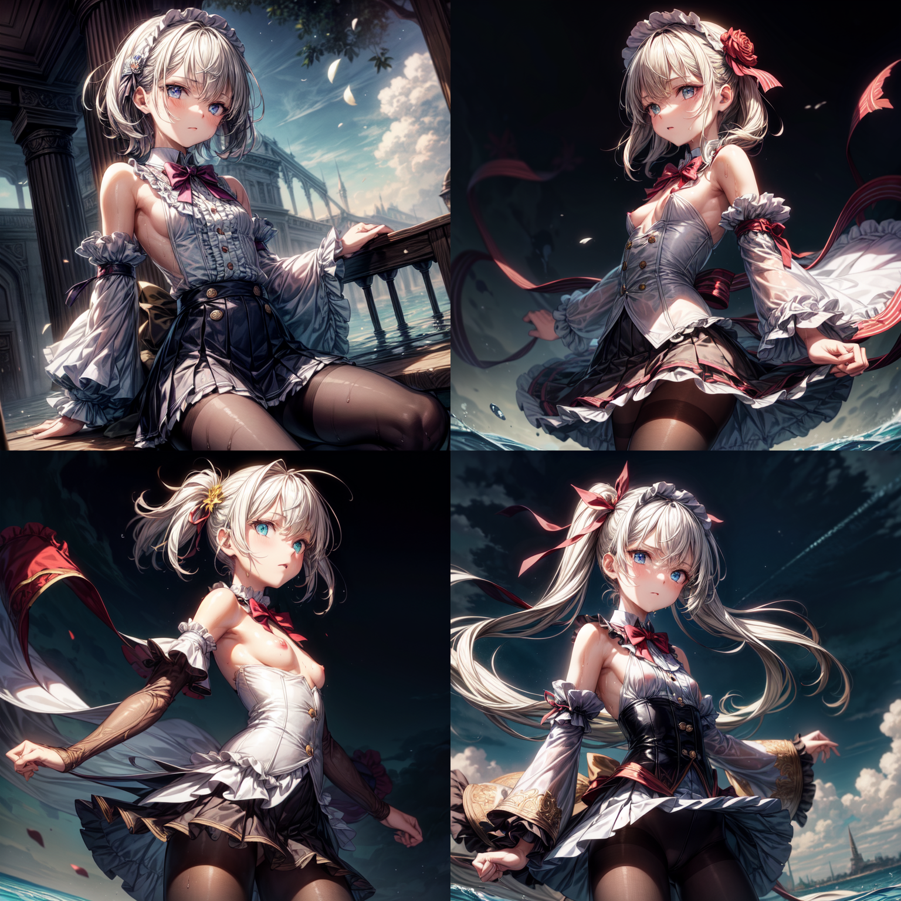
      * `Flat-2D Animerge`
        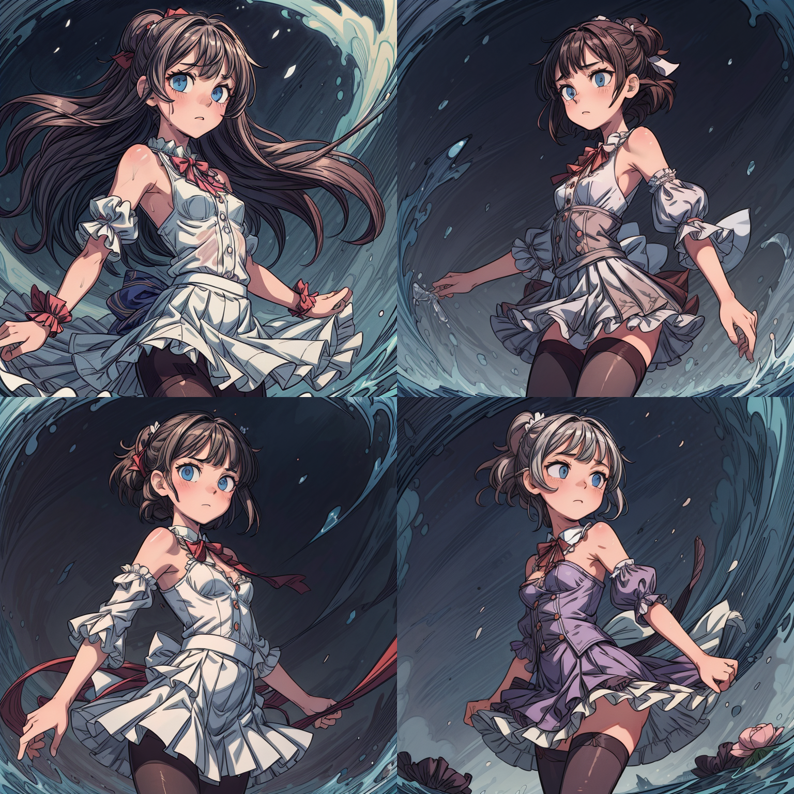